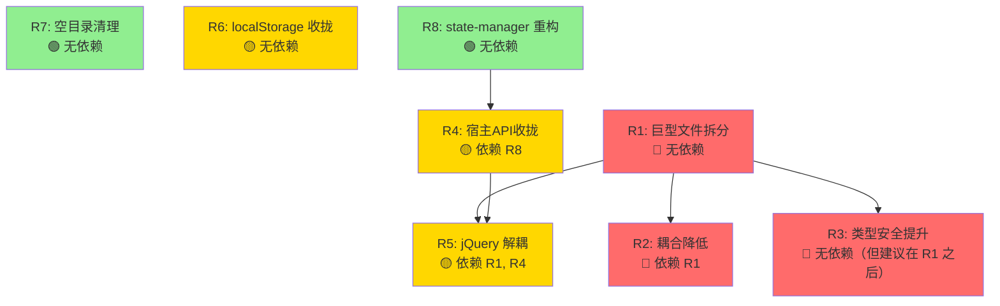
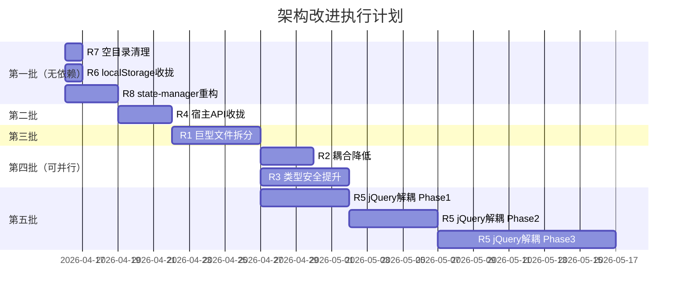

# 🏗️ 架构改进重构计划（全项）

> **编写者**：牧濑红莉栖  
> **日期**：2026-04-15  
> **基于**：架构分析报告 v1.0  
> **项目版本**：v1.1.0  
> **状态**：📋 计划阶段

---

## 一、概览

本文档覆盖架构分析报告中识别的 **全部 8 项风险/改进项**，为每一项提供详细的重构计划。

### 改进项清单

| 编号 | 改进项 | 优先级 | 预估工作量 | 状态 |
|:----:|--------|:------:|:----------:|:----:|
| R7 | 空目录清理 | 🟢 低 | 极小（5分钟） | ✅ 已完成 |
| R6 | service 层 localStorage 泄漏收拢 | 🟡 中 | 小（30分钟） | ✅ 已完成 |
| R8 | state-manager 万能中转站重构 | 🟢 低 | 中（2-3小时） | ✅ 已完成 |
| R4 | Presentation 层宿主 API 收拢 | 🟡 中 | 中（2-3小时） | ✅ 已完成 |
| R3 | 类型安全提升（strict + any 消除） | 🔴 高 | 大（1-2天） | ✅ 已完成 |
| R2 | service 层内部耦合降低 | 🔴 高 | 大（1-2天） | ✅ 已完成 |
| R1 | 巨型文件拆分（9个 > 1,000行） | 🔴 高 | 极大（3-5天） | ✅ 已完成（9/9） |
| R5 | jQuery 深度绑定解耦 | 🟡 中 | 极大（5-10天） | ⬜ 待执行 |

### 依赖关系



### 推荐执行顺序

```
第一批（无依赖，可并行）：R7 → R6 → R8
第二批（R8 完成后）：    R4
第三批（独立大工程）：    R1
第四批（R1 完成后）：    R2、R3（可并行）
第五批（R1+R4 完成后）： R5
```

---

## 二、R7：空目录清理

### 2.1 问题现状

项目中存在 2 个空目录，是三层架构迁移时的遗留产物：

| 空目录 | 原用途推测 | 对应功能已迁移至 |
|--------|-----------|-----------------|
| `src/service/data-admin/` | 数据管理业务逻辑 | `src/presentation/triggers/data-admin-ui.ts` |
| `src/service/import/` | 导入业务逻辑 | `src/presentation/triggers/import-process.ts` |

### 2.2 影响分析

- **严重程度**：极低
- **影响范围**：无功能影响，仅影响代码整洁度
- **风险**：零风险

### 2.3 方案

直接删除这两个空目录。

### 2.4 执行步骤

| 步骤 | 操作 | 验证 |
|:----:|------|------|
| 1 | 确认目录为空：`find src/service/data-admin src/service/import -type f` 应返回空 | 无文件输出 |
| 2 | 删除目录：`rm -rf src/service/data-admin src/service/import` | 目录不存在 |
| 3 | 搜索是否有 import 引用这两个目录：`grep -r "data-admin\|/import/" src/ --include="*.ts"` | 无匹配（排除 import-process 等无关匹配） |
| 4 | 编译验证：`npx tsc --noEmit` | 零错误 |

### 2.5 验证方法

```bash
# 确认空目录已删除
find src -type d -empty  # 应返回空

# 编译通过
npx tsc --noEmit  # 零错误
```

---

## 三、R6：service 层 localStorage 泄漏收拢

### 3.1 问题现状

`src/service/optimization/content-optimization.ts` 中有 **2 处**直接调用 `localStorage`，绕过了 data 层的存储抽象：

| 位置 | 行号 | 操作 | 用途 |
|------|:----:|------|------|
| `content-optimization.ts` | 625 | `localStorage.setItem('ACU_LAST_OPTIMIZATION_BASE', ...)` | 写入正文优化基础缓存 |
| `content-optimization.ts` | 650 | `localStorage.getItem('ACU_LAST_OPTIMIZATION_BASE')` | 读取正文优化基础缓存 |

### 3.2 影响分析

- **严重程度**：中等
- **影响范围**：service 层存储一致性被破坏，data 层无法统一管理所有存储操作
- **风险**：如果未来要替换存储后端（如 SQLite），这 2 处会被遗漏

### 3.3 方案设计

在 `src/data/storage/` 下新增一个 `optimization-cache-storage.ts`，封装 localStorage 的读写操作，然后让 `content-optimization.ts` 通过这个存储适配器访问缓存。

**为什么不放到已有的 `config-storage.ts`？**
- `config-storage.ts` 封装的是 SillyTavern 扩展设置的读写（通过 `tavern-storage.ts`）
- 正文优化缓存是浏览器侧的 localStorage 缓存，性质不同
- 单独的文件更符合单一职责原则

### 3.4 涉及文件

| 文件 | 操作 |
|------|------|
| `src/data/storage/optimization-cache-storage.ts` | **新建** — localStorage 缓存适配器 |
| `src/service/optimization/content-optimization.ts` | **修改** — 替换直接 localStorage 调用为适配器调用 |

### 3.5 执行步骤

#### Step 1：新建 `optimization-cache-storage.ts`

```typescript
// src/data/storage/optimization-cache-storage.ts

const OPTIMIZATION_BASE_KEY = 'ACU_LAST_OPTIMIZATION_BASE';

/**
 * 正文优化基础缓存 — 浏览器侧 localStorage 存储适配器
 * 
 * 用于缓存正文优化的基础数据，避免重复计算。
 * 这是运行时缓存，不是持久化数据，丢失不影响功能。
 */

/** 写入正文优化基础缓存 */
export function saveOptimizationBaseCache_ACU(cache: unknown): void {
    try {
        localStorage.setItem(OPTIMIZATION_BASE_KEY, JSON.stringify(cache));
    } catch (error) {
        // 由调用方决定是否需要日志，这里静默失败
        throw error;
    }
}

/** 读取正文优化基础缓存，不存在或解析失败返回 null */
export function loadOptimizationBaseCache_ACU(): unknown | null {
    try {
        const raw = localStorage.getItem(OPTIMIZATION_BASE_KEY);
        if (!raw) return null;
        return JSON.parse(raw);
    } catch {
        return null;
    }
}
```

#### Step 2：修改 `content-optimization.ts`

**修改前**（第 625 行附近）：
```typescript
localStorage.setItem('ACU_LAST_OPTIMIZATION_BASE', JSON.stringify(cache));
```

**修改后**：
```typescript
import { saveOptimizationBaseCache_ACU, loadOptimizationBaseCache_ACU } from '../../data/storage/optimization-cache-storage';

// 第 625 行附近
saveOptimizationBaseCache_ACU(cache);
```

**修改前**（第 650 行附近）：
```typescript
const raw = localStorage.getItem('ACU_LAST_OPTIMIZATION_BASE');
```

**修改后**：
```typescript
// 第 650 行附近
const cached = loadOptimizationBaseCache_ACU();
```

> **注意**：需要阅读第 620-665 行的完整上下文，确认 try-catch 和日志逻辑的调整方式。原代码的 try-catch 中包含 `logDebug_ACU` 调用，新适配器的错误处理需要与之协调。

### 3.6 验证方法

```bash
# 1. 确认 service 层零 localStorage 直接调用
grep -rn "localStorage\|sessionStorage" src/service/ --include="*.ts" | grep -v "注释\|//"
# 应只剩注释行（settings-service.ts 第 68 行的注释）

# 2. 确认 data 层新增了存储适配器
ls src/data/storage/optimization-cache-storage.ts

# 3. 编译通过
npx tsc --noEmit  # 零错误

# 4. 功能验证：正文优化功能正常工作，缓存读写正常
```

---

## 四、R8：state-manager 万能中转站重构

### 4.1 问题现状

`src/service/runtime/state-manager.ts`（234 行）承担了"全局状态容器 + 符号中转站"的双重角色：

| 指标 | 数值 |
|------|:----:|
| 导出符号数 | 58 个 |
| 被引用文件数 | 54 个（38 个 presentation + 16 个 service） |
| 文件行数 | 234 行 |

**问题本质**：state-manager 混合了三类完全不同性质的导出：

| 类别 | 示例 | 数量（估） | 性质 |
|------|------|:----------:|------|
| **宿主 API re-export** | `SillyTavern_API_ACU`, `jQuery_API_ACU`, `TavernHelper_API_ACU`, `toastr_API_ACU` | ~8 | 外部依赖引用 |
| **运行时可变状态** | `settings_ACU`, `currentJsonTableData_ACU`, `loopState_ACU`, `generationGate_ACU` | ~30 | 业务运行时状态 |
| **工具函数/常量** | `getCurrentIsolationKey_ACU`, `NEW_MESSAGE_DEBOUNCE_DELAY_ACU` | ~20 | 纯函数/常量 |

这导致：
1. 任何文件想用一个 `settings_ACU` 就必须 import 这个巨型模块
2. 无法从 import 语句判断一个文件到底依赖了什么——是宿主 API？运行时状态？还是工具函数？
3. 修改 state-manager 的任何导出都可能影响 54 个文件

### 4.2 影响分析

- **严重程度**：中等
- **影响范围**：54 个文件的 import 语句
- **风险**：重构过程中 import 路径变更可能导致编译错误，但 tsc 会立即捕获

### 4.3 方案设计

将 state-manager 拆分为 **3 个职责明确的模块**：

```
src/service/runtime/
├── state-manager.ts          ← 保留，仅管理运行时可变状态
├── host-api-reexport.ts      ← 新建，宿主 API 的 re-export
└── runtime-utils.ts          ← 新建，工具函数和常量
```

**拆分原则**：
- `state-manager.ts`：只保留 `let` 声明的可变状态变量及其 getter/setter
- `host-api-reexport.ts`：只做 `shared/host-api.ts` 的 re-export（`SillyTavern_API_ACU` 等 4 个 + setter）
- `runtime-utils.ts`：纯函数（`getCurrentIsolationKey_ACU` 等）和常量（`NEW_MESSAGE_DEBOUNCE_DELAY_ACU` 等）

**向后兼容策略**：
- 拆分后，在 `state-manager.ts` 中保留 re-export，确保所有现有 import 不需要立即修改
- 然后逐步将各文件的 import 迁移到具体模块
- 最后删除 state-manager 中的 re-export

### 4.4 涉及文件

| 文件 | 操作 |
|------|------|
| `src/service/runtime/host-api-reexport.ts` | **新建** — 宿主 API re-export |
| `src/service/runtime/runtime-utils.ts` | **新建** — 工具函数和常量 |
| `src/service/runtime/state-manager.ts` | **修改** — 移除非状态导出，添加临时 re-export |
| 38 个 presentation 文件 | **修改** — 逐步迁移 import 路径 |
| 16 个 service 文件 | **修改** — 逐步迁移 import 路径 |

### 4.5 执行步骤

#### Phase 1：拆分（不破坏现有代码）

| 步骤 | 操作 |
|:----:|------|
| 1 | 读取 `state-manager.ts` 完整内容，分类所有 58 个导出符号 |
| 2 | 新建 `host-api-reexport.ts`，从 `shared/host-api.ts` re-export 宿主 API 相关符号 |
| 3 | 新建 `runtime-utils.ts`，移入工具函数和常量 |
| 4 | 修改 `state-manager.ts`，移除已迁出的定义，改为从新模块 re-export（保持向后兼容） |
| 5 | 编译验证：`npx tsc --noEmit` 零错误 |

#### Phase 2：迁移 import（逐文件）

| 步骤 | 操作 |
|:----:|------|
| 6 | 对每个引用 state-manager 的文件，分析其 import 的符号属于哪个新模块 |
| 7 | 将 import 路径从 `state-manager` 改为具体模块（`host-api-reexport` / `runtime-utils` / `state-manager`） |
| 8 | 每修改 5-10 个文件后编译验证一次 |

#### Phase 3：清理

| 步骤 | 操作 |
|:----:|------|
| 9 | 删除 `state-manager.ts` 中的临时 re-export |
| 10 | 最终编译验证 |

### 4.6 风险评估

| 风险 | 概率 | 影响 | 缓解措施 |
|------|:----:|:----:|---------|
| import 路径错误导致编译失败 | 中 | 低 | tsc 会立即报错，逐文件修改+编译验证 |
| 循环依赖 | 低 | 中 | 拆分前先画出依赖图，确保新模块之间无循环 |
| 遗漏某个文件的 import 迁移 | 低 | 低 | Phase 3 删除 re-export 时 tsc 会报错 |

### 4.7 验证方法

```bash
# 1. state-manager 导出符号数应大幅减少
grep -c "export " src/service/runtime/state-manager.ts  # 目标：< 25

# 2. 新模块存在且有内容
wc -l src/service/runtime/host-api-reexport.ts src/service/runtime/runtime-utils.ts

# 3. 编译通过
npx tsc --noEmit

# 4. 无文件仍从 state-manager import 宿主 API（Phase 3 完成后）
grep -rn "from.*state-manager.*SillyTavern_API_ACU\|from.*state-manager.*jQuery_API_ACU" src/ --include="*.ts"
# 应返回空
```

---

## 五、R4：Presentation 层宿主 API 收拢

### 5.1 问题现状

Presentation 层有 **17 处 import** 直接引用宿主 API 变量（`SillyTavern_API_ACU`、`TavernHelper_API_ACU`），分布在 **11 个文件**中：

| 文件 | import 的宿主 API |
|------|-------------------|
| `bootstrap/api-groups/plot-preset-api.ts` | `SillyTavern_API_ACU` |
| `bootstrap/init.ts` | `SillyTavern_API_ACU` |
| `bootstrap/startup.ts` | `SillyTavern_API_ACU` |
| `triggers/update-trigger.ts` | `SillyTavern_API_ACU`, `TavernHelper_API_ACU` |
| `triggers/settings-ui-sync.ts` | `SillyTavern_API_ACU`, `TavernHelper_API_ACU`（+ setter） |
| `triggers/update-process.ts` | `SillyTavern_API_ACU` |
| `triggers/auto-loop.ts` | `SillyTavern_API_ACU` |
| `triggers/data-admin-ui.ts` | `SillyTavern_API_ACU`, `TavernHelper_API_ACU` |
| `triggers/import-process.ts` | `TavernHelper_API_ACU` |
| `components/update-status-display.ts` | `SillyTavern_API_ACU` |
| `components/optimization-ui.ts` | `SillyTavern_API_ACU` |
| `components/worldbook-selector.ts` | `TavernHelper_API_ACU` |
| `pages/visualizer-main.ts` | `SillyTavern_API_ACU` |
| `pages/popup-bindings-worldbook.ts` | `TavernHelper_API_ACU` |
| `pages/popup-bindings.ts` | `TavernHelper_API_ACU` |
| `pages/popup-bindings-data.ts` | `TavernHelper_API_ACU` |
| `pages/popup-bindings-plot.ts` | `TavernHelper_API_ACU` |

### 5.2 影响分析

- **严重程度**：中等
- **影响范围**：如果要替换 UI 框架或更换宿主平台，这 17 处引用都需要逐一处理
- **风险**：presentation 层直接持有宿主 API 引用，意味着 UI 层与宿主平台紧耦合

### 5.3 方案设计

**核心思路**：presentation 层不应该直接知道 `SillyTavern_API_ACU` 的存在。它需要的是"能力"而非"实现"。

分析 presentation 层使用宿主 API 的具体场景，将其归类为以下几种"能力"：

| 能力 | 对应的宿主 API 调用 | 封装位置 |
|------|---------------------|---------|
| 获取聊天数据 | `SillyTavern_API_ACU.chat`, `.name2` 等 | 已有 `data/gateways/chat-gateway.ts` |
| 获取角色数据 | `SillyTavern_API_ACU.characters` 等 | 已有 `data/gateways/character-gateway.ts` |
| 获取运行时状态 | `SillyTavern_API_ACU.online_status` 等 | 已有 `data/gateways/host-state-gateway.ts` |
| 世界书操作 | `TavernHelper_API_ACU.getWorldBookEntries()` 等 | 已有 `data/gateways/worldbook-gateway.ts` |
| UI 交互（toast、DOM） | `toastr_API_ACU.info()`, `jQuery_API_ACU(...)` | 属于 presentation 层自身，不需要收拢 |
| 触发宿主动作 | `SillyTavern_API_ACU.Generate()`, `.reloadChat()` 等 | 需要新增 `host-action-gateway.ts` |

**方案**：
1. 在 `data/gateways/` 新增 `host-action-gateway.ts`，封装 presentation 层需要的宿主动作调用
2. 逐文件将 `SillyTavern_API_ACU.xxx()` 替换为 gateway 调用
3. `settings-ui-sync.ts` 中的 setter（`_set_SillyTavern_API_ACU` 等）是初始化逻辑，保留在 bootstrap 层

**注意**：`jQuery_API_ACU` 和 `toastr_API_ACU` 是 UI 工具，属于 presentation 层的合法依赖，不在本项收拢范围内。本项只收拢 `SillyTavern_API_ACU` 和 `TavernHelper_API_ACU`。

### 5.4 前置依赖

- **依赖 R8**：R8 完成后，宿主 API re-export 已从 state-manager 分离到 `host-api-reexport.ts`，迁移路径更清晰

### 5.5 涉及文件

| 文件 | 操作 |
|------|------|
| `src/data/gateways/host-action-gateway.ts` | **新建** — 封装宿主动作调用 |
| 可能需要扩展已有 gateway | **修改** — 补充 presentation 层需要但尚未封装的方法 |
| 11 个 presentation 文件 | **修改** — 替换直接宿主 API 调用为 gateway 调用 |

### 5.6 执行步骤

| 步骤 | 操作 |
|:----:|------|
| 1 | 逐一读取 11 个 presentation 文件，记录每处 `SillyTavern_API_ACU` / `TavernHelper_API_ACU` 的具体调用方式 |
| 2 | 将调用分类：哪些已被现有 gateway 覆盖、哪些需要新增 gateway 方法 |
| 3 | 新建 `host-action-gateway.ts`，封装未覆盖的宿主动作 |
| 4 | 扩展已有 gateway（如需要） |
| 5 | 逐文件替换 presentation 层的直接调用为 gateway 调用 |
| 6 | 每修改 3-5 个文件后编译验证 |
| 7 | 最终验证：presentation 层零 `SillyTavern_API_ACU` / `TavernHelper_API_ACU` import（bootstrap 初始化除外） |

### 5.7 特殊处理

**`settings-ui-sync.ts` 的 setter 调用**：
```typescript
_set_SillyTavern_API_ACU(...)
_set_TavernHelper_API_ACU(...)
_set_jQuery_API_ACU(...)
_set_toastr_API_ACU(...)
```
这些是启动阶段的初始化逻辑，负责将宿主 API 注入到系统中。这属于 bootstrap 的合法职责，**不需要收拢**。但应确保只有 `bootstrap/` 目录下的文件才调用这些 setter。

### 5.8 验证方法

```bash
# 1. presentation 层零 SillyTavern_API_ACU import（bootstrap 除外）
grep -rn "import.*SillyTavern_API_ACU" src/presentation/ --include="*.ts" | grep -v "bootstrap/"
# 应返回空

# 2. presentation 层零 TavernHelper_API_ACU import（bootstrap 除外）
grep -rn "import.*TavernHelper_API_ACU" src/presentation/ --include="*.ts" | grep -v "bootstrap/"
# 应返回空

# 3. 编译通过
npx tsc --noEmit

# 4. 新 gateway 存在
ls src/data/gateways/host-action-gateway.ts
```

---

## 六、R3：类型安全提升

### 6.1 问题现状

#### 6.1.1 strict 模式关闭

`tsconfig.json` 中 `"strict": false`，意味着以下检查全部关闭：
- `strictNullChecks`：不检查 null/undefined
- `strictFunctionTypes`：不检查函数参数类型
- `strictBindCallApply`：不检查 bind/call/apply 参数
- `strictPropertyInitialization`：不检查类属性初始化
- `noImplicitAny`：允许隐式 any
- `noImplicitThis`：允许隐式 this

#### 6.1.2 显式 any 类型

`src/shared/host-api.ts` 中 4 个核心变量全部是 `any` 类型：

```typescript
export let SillyTavern_API_ACU: any;
export let TavernHelper_API_ACU: any;
export let jQuery_API_ACU: any;
export let toastr_API_ACU: any;
```

这 4 个变量被 54 个文件引用，`any` 类型像病毒一样扩散到整个代码库——任何使用这些变量的地方都失去了类型检查。

### 6.2 影响分析

- **严重程度**：高
- **影响范围**：整个代码库的类型安全性
- **风险**：开启 strict 可能暴露大量编译错误（预估 50-200 个），需要分阶段处理

### 6.3 方案设计

分两条线并行推进：

**线路 A：消除 host-api.ts 的 any 类型**

为 4 个宿主 API 变量定义具体的 TypeScript 接口：

```typescript
// 目标状态
export let SillyTavern_API_ACU: ISillyTavernAPI;
export let TavernHelper_API_ACU: ITavernHelperAPI;
export let jQuery_API_ACU: JQueryStatic;
export let toastr_API_ACU: IToastrAPI;
```

接口定义来源：
- `@types/function/` 和 `@types/iframe/` 目录下已有 31 个 `.d.ts` 文件，可能已包含部分定义
- 需要审查这些类型定义文件，确认覆盖度
- 缺失的接口需要根据实际使用情况补充

**线路 B：逐步开启 strict 子选项**

不要一次性开启 `strict: true`，而是逐个开启子选项，每次修复一类错误：

| 阶段 | 开启选项 | 预估错误数 | 修复难度 |
|:----:|---------|:----------:|:--------:|
| B-1 | `noImplicitAny` | 多 | 中 |
| B-2 | `strictNullChecks` | 极多 | 高 |
| B-3 | `strictFunctionTypes` | 少 | 低 |
| B-4 | `strictBindCallApply` | 极少 | 低 |
| B-5 | `strictPropertyInitialization` | 中 | 中 |
| B-6 | `noImplicitThis` | 少 | 低 |
| B-7 | 替换为 `strict: true` | 0（前面已全部修复） | 无 |

### 6.4 前置建议

- **建议在 R1（巨型文件拆分）之后执行**：拆分后的小文件更容易逐个修复类型错误
- **线路 A 可以独立先行**：消除 any 不依赖 strict 模式

### 6.5 涉及文件

**线路 A**：
| 文件 | 操作 |
|------|------|
| `src/shared/host-api.ts` | **修改** — 替换 any 为具体接口 |
| `@types/` 目录 | **修改/新建** — 补充接口定义 |
| 所有使用宿主 API 的文件 | **可能修改** — 修复因类型收紧导致的编译错误 |

**线路 B**：
| 文件 | 操作 |
|------|------|
| `tsconfig.json` | **修改** — 逐步添加 strict 子选项 |
| 全部 105 个 `.ts` 文件 | **可能修改** — 修复编译错误 |

### 6.6 执行步骤

#### 线路 A：消除 any

| 步骤 | 操作 |
|:----:|------|
| 1 | 审查 `@types/` 目录下所有 `.d.ts` 文件，确认已有的接口定义 |
| 2 | 搜索代码库中所有 `SillyTavern_API_ACU.xxx` 调用，收集实际使用的属性和方法 |
| 3 | 搜索代码库中所有 `TavernHelper_API_ACU.xxx` 调用，收集实际使用的属性和方法 |
| 4 | 对比已有类型定义和实际使用，补充缺失的接口成员 |
| 5 | 修改 `host-api.ts`，将 `any` 替换为具体接口 |
| 6 | 编译，修复因类型收紧导致的错误 |

#### 线路 B：开启 strict

| 步骤 | 操作 |
|:----:|------|
| 1 | 在 `tsconfig.json` 中添加 `"noImplicitAny": true` |
| 2 | 编译，记录错误数量和分布 |
| 3 | 逐文件修复 `noImplicitAny` 错误 |
| 4 | 重复上述过程，依次开启 `strictNullChecks`、`strictFunctionTypes` 等 |
| 5 | 所有子选项开启后，替换为 `"strict": true` |

### 6.7 验证方法

```bash
# 线路 A 验证
grep ": any" src/shared/host-api.ts  # 应返回空

# 线路 B 验证
grep '"strict"' tsconfig.json  # 应显示 "strict": true

# 最终验证
npx tsc --noEmit  # 零错误
```

---

## 七、R2：service 层内部耦合降低

### 7.1 问题现状

service 层有 **16 个文件**存在 4 个以上的跨子模块 import，形成了复杂的依赖网络：

| 文件 | 跨模块 import 数 | 所属子模块 |
|------|:----------------:|-----------|
| `settings-service.ts` | 19 | settings |
| `chat-scope.ts` | 16 | template |
| `helpers-plot-runtime.ts` | 15 | runtime |
| `template-preset-service.ts` | 13 | template |
| `pipeline.ts` | 11 | worldbook |
| `helpers-data-merge.ts` | 10 | runtime |
| `injection-engine-state.ts` | 10 | worldbook |
| `merge-logic.ts` | 9 | summary |
| `content-optimization.ts` | 8 | optimization |
| `prompt-builder.ts` | 8 | ai |
| `table-service.ts` | 8 | table |
| `plot-logic.ts` | 7 | plot |
| `injection-engine-custom.ts` | 7 | worldbook |
| `helpers-template-vars.ts` | 4 | runtime |
| `state-manager.ts` | 4 | runtime |
| `injection-engine-entries.ts` | 4 | worldbook |

**依赖热力图**（被依赖最多的子模块）：

```
runtime     ████████████████████  被几乎所有子模块依赖
worldbook   ████████████          被 template, plot, runtime 依赖
template    ████████              被 runtime, worldbook 依赖
settings    ██████                被多个子模块依赖
ai          ████                  被 runtime, optimization 依赖
plot        ████                  被 runtime 依赖
```

### 7.2 影响分析

- **严重程度**：高
- **影响范围**：修改任何一个 service 子模块都可能波及其他子模块
- **风险**：高耦合导致修改成本高、回归风险大

### 7.3 方案设计

**核心策略：提取共享接口层**

高耦合的根本原因是子模块之间直接 import 具体实现。解决方案是提取一个 `service/shared/` 目录，存放跨模块共享的：
- **接口定义**（interface）：子模块依赖接口而非实现
- **共享类型**（type）：跨模块使用的数据类型
- **共享常量**：跨模块使用的常量

```
src/service/
├── shared/                    ← 新建：service 层内部共享
│   ├── interfaces.ts          ← 跨模块接口定义
│   ├── types.ts               ← 跨模块类型定义
│   └── constants.ts           ← 跨模块常量
├── runtime/
├── worldbook/
├── template/
└── ...
```

**降耦合目标**：将每个文件的跨模块 import 数降到 3 以下。

### 7.4 前置依赖

- **依赖 R1**：巨型文件拆分后，每个文件的职责更单一，跨模块依赖自然减少。建议 R1 完成后重新统计耦合数据，再决定具体的降耦合策略。

### 7.5 执行步骤

| 步骤 | 操作 |
|:----:|------|
| 1 | **（R1 完成后）** 重新统计所有 service 文件的跨模块 import 数 |
| 2 | 分析高耦合文件的 import 内容，识别哪些是"接口依赖"、哪些是"实现依赖" |
| 3 | 提取跨模块共享的接口和类型到 `service/shared/` |
| 4 | 将"实现依赖"改为"接口依赖"（依赖倒置） |
| 5 | 对于无法通过接口解耦的情况（如直接调用另一个模块的函数），考虑是否应该合并子模块或提取公共服务 |
| 6 | 逐步修改，每次修改后编译验证 |

### 7.6 验证方法

```bash
# 统计跨模块 import 数
for f in $(find src/service -name "*.ts"); do
  deps=$(grep -c "from '\.\.\/" "$f" 2>/dev/null)
  if [ "$deps" -gt 3 ]; then
    echo "$f: $deps"
  fi
done
# 目标：输出为空（所有文件 <= 3 个跨模块 import）

# 编译通过
npx tsc --noEmit
```

---

## 八、R1：巨型文件拆分

### 8.1 问题现状

项目中有 **9 个文件**超过 1,000 行，**26 个文件**超过 500 行：

| 文件 | 行数 | 层级 | 主要职责 |
|------|:----:|------|---------|
| `helpers-template-vars.ts` | 1,636 | service/runtime | 模板变量处理（变量解析、替换、计算） |
| `helpers-plot-runtime.ts` | 1,617 | service/runtime | 剧情运行时（剧情推进、状态管理、AI 调用） |
| `prompt-builder.ts` | 1,603 | service/ai | Prompt 构建（多种 prompt 模板、fallback 链） |
| `visualizer.ts` | 1,473 | presentation/pages | 可视化器 UI（HTML 生成、事件绑定、数据展示） |
| `main-popup.ts` | 1,413 | presentation/pages | 主弹窗 UI（HTML 生成、Tab 切换、布局） |
| `chat-scope.ts` | 1,409 | service/template | 聊天作用域（消息扫描、模板匹配、作用域计算） |
| `optimization-ui.ts` | 1,356 | presentation/components | 优化 UI（正文优化界面、交互逻辑） |
| `settings-ui-sync.ts` | 1,313 | presentation/triggers | 设置同步（UI ↔ 数据双向同步、事件监听） |
| `visualizer-main.ts` | 1,151 | presentation/pages | 可视化器主逻辑（数据处理、渲染控制） |

### 8.2 影响分析

- **严重程度**：高
- **影响范围**：代码可维护性、代码审查效率、新开发者上手成本
- **风险**：拆分过程中可能引入循环依赖，需要仔细设计模块边界

### 8.3 方案设计

**拆分原则**：
1. **按职责拆分**：每个新文件只负责一个明确的职责
2. **保持公共 API 不变**：通过 index.ts 或原文件 re-export，确保外部调用方不需要修改
3. **先 service 后 presentation**：service 层的拆分影响范围更大，优先处理

**各文件拆分预案**：

#### 8.3.1 `helpers-template-vars.ts`（1,636行）→ 3-4 个文件

```
service/runtime/
├── template-vars/
│   ├── index.ts                    ← re-export 公共 API
│   ├── template-var-parser.ts      ← 模板变量解析
│   ├── template-var-resolver.ts    ← 模板变量求值/替换
│   └── template-var-builtins.ts    ← 内置变量定义
```

#### 8.3.2 `helpers-plot-runtime.ts`（1,617行）→ 3-4 个文件

```
service/runtime/
├── plot-runtime/
│   ├── index.ts                    ← re-export 公共 API
│   ├── plot-executor.ts            ← 剧情执行引擎
│   ├── plot-state-machine.ts       ← 剧情状态机
│   └── plot-ai-integration.ts      ← 剧情 AI 调用集成
```

#### 8.3.3 `prompt-builder.ts`（1,603行）→ 3-4 个文件

```
service/ai/
├── prompt/
│   ├── index.ts                    ← re-export 公共 API
│   ├── prompt-assembler.ts         ← Prompt 组装主逻辑
│   ├── prompt-templates.ts         ← Prompt 模板定义
│   └── prompt-fallback.ts          ← Fallback 链处理
```

#### 8.3.4 `visualizer.ts`（1,473行）→ 3 个文件

```
presentation/pages/
├── visualizer/
│   ├── index.ts                    ← re-export 公共 API
│   ├── visualizer-html.ts          ← HTML 生成
│   ├── visualizer-events.ts        ← 事件绑定
│   └── visualizer-data.ts          ← 数据处理
```

#### 8.3.5 `main-popup.ts`（1,413行）→ 3 个文件

```
presentation/pages/
├── main-popup/
│   ├── index.ts                    ← re-export 公共 API
│   ├── main-popup-html.ts          ← HTML 生成
│   ├── main-popup-tabs.ts          ← Tab 切换逻辑
│   └── main-popup-layout.ts        ← 布局管理
```

#### 8.3.6 `chat-scope.ts`（1,409行）→ 3 个文件

```
service/template/
├── chat-scope/
│   ├── index.ts                    ← re-export 公共 API
│   ├── message-scanner.ts          ← 消息扫描
│   ├── scope-calculator.ts         ← 作用域计算
│   └── template-matcher.ts         ← 模板匹配
```

#### 8.3.7 `optimization-ui.ts`（1,356行）→ 2-3 个文件

```
presentation/components/
├── optimization/
│   ├── index.ts                    ← re-export 公共 API
│   ├── optimization-ui-html.ts     ← HTML 生成
│   └── optimization-ui-logic.ts    ← 交互逻辑
```

#### 8.3.8 `settings-ui-sync.ts`（1,313行）→ 2-3 个文件

```
presentation/triggers/
├── settings-sync/
│   ├── index.ts                    ← re-export 公共 API
│   ├── settings-to-ui.ts           ← 数据 → UI 同步
│   └── ui-to-settings.ts           ← UI → 数据同步
```

#### 8.3.9 `visualizer-main.ts`（1,151行）→ 2-3 个文件

```
presentation/pages/
├── visualizer/                     ← 与 8.3.4 合并到同一目录
│   ├── visualizer-main-render.ts   ← 渲染控制
│   └── visualizer-main-data.ts     ← 数据处理
```

### 8.4 执行步骤

| 步骤 | 操作 |
|:----:|------|
| 1 | 逐一读取 9 个巨型文件，分析内部函数/类的职责边界 |
| 2 | 为每个文件制定具体的拆分方案（哪些函数归入哪个新文件） |
| 3 | 按优先级逐个拆分：先 service 层（影响范围大），后 presentation 层 |
| 4 | 每拆分一个文件后：创建子目录 → 移动代码 → 添加 index.ts re-export → 编译验证 |
| 5 | 搜索所有引用原文件的 import，确认 re-export 覆盖完整 |
| 6 | 全部拆分完成后，最终编译验证 |

### 8.5 风险评估

| 风险 | 概率 | 影响 | 缓解措施 |
|------|:----:|:----:|---------|
| 循环依赖 | 中 | 高 | 拆分前画出函数调用图，确保新文件之间无循环 |
| import 路径断裂 | 中 | 低 | index.ts re-export 保持公共 API 不变 |
| 拆分粒度不当 | 低 | 中 | 先分析再拆分，每个新文件 200-500 行为宜 |

### 8.6 验证方法

```bash
# 1. 无文件超过 1,000 行
find src -name "*.ts" -exec wc -l {} + | sort -rn | awk '$1 >= 1000 && !/total/'
# 应返回空

# 2. 编译通过
npx tsc --noEmit

# 3. 总代码行数不应显著变化（允许因 index.ts 增加少量）
find src -name "*.ts" -o -name "*.js" | xargs wc -l | tail -1
# 应接近 37,432
```

---

## 九、R5：jQuery 深度绑定解耦

### 9.1 问题现状

Presentation 层有 **308 处** `jQuery_API_ACU` 引用，分布在几乎所有 UI 文件中。jQuery 被用于：

| 用途 | 示例 | 占比（估） |
|------|------|:----------:|
| DOM 查询 | `jQuery_API_ACU('#acu-table')` | 40% |
| 事件绑定 | `jQuery_API_ACU(document).on('click', ...)` | 25% |
| DOM 操作 | `jQuery_API_ACU(el).html(...)`, `.append(...)`, `.remove()` | 20% |
| CSS 操作 | `jQuery_API_ACU(el).css(...)`, `.addClass(...)` | 10% |
| 动画/效果 | `jQuery_API_ACU(el).fadeIn()`, `.slideToggle()` | 5% |

此外，HTML 通过**字符串拼接**生成（而非模板引擎或 JSX），这使得：
- 无法做组件级别的单元测试
- XSS 风险（用户数据直接拼入 HTML）
- 代码可读性差（大段 HTML 字符串）

### 9.2 影响分析

- **严重程度**：中等（功能正常，但可维护性差）
- **影响范围**：整个 presentation 层
- **风险**：这是最大的重构工程，需要极其谨慎

### 9.3 方案设计

**现实评估**：完全去除 jQuery 并替换为现代框架（React/Vue/Svelte）是一个**重写级别**的工程，不适合作为重构来做。

**务实方案：渐进式解耦**

分三个阶段，每个阶段都是独立可交付的：

#### Phase 1：引入 DOM 工具层（隔离 jQuery）

在 `src/presentation/` 下新建 `dom-utils.ts`，封装常用的 DOM 操作：

```typescript
// src/presentation/dom-utils.ts
import { jQuery_API_ACU } from '../service/runtime/state-manager';

/** 查询 DOM 元素 */
export function query_ACU(selector: string): JQuery {
    return jQuery_API_ACU(selector);
}

/** 安全设置 HTML（转义用户输入） */
export function safeHtml_ACU(el: JQuery, html: string): void {
    el.html(html);
}

/** 绑定事件（带命名空间） */
export function on_ACU(el: JQuery, event: string, handler: Function): void {
    el.on(event, handler as any);
}

// ... 更多封装
```

这样做的好处：
- jQuery 的引用集中到一个文件
- 未来替换 jQuery 时只需修改这一个文件
- 可以在封装层加入安全检查（如 XSS 防护）

#### Phase 2：HTML 模板化

将字符串拼接的 HTML 改为模板函数：

```typescript
// 修改前
const html = `<div class="acu-row">
    <span>${name}</span>
    <input value="${value}">
</div>`;

// 修改后
function renderRow(name: string, value: string): string {
    return `<div class="acu-row">
        <span>${escapeHtml(name)}</span>
        <input value="${escapeHtml(value)}">
    </div>`;
}
```

#### Phase 3：组件化（长期目标）

将 UI 拆分为独立的"组件"，每个组件管理自己的 HTML 生成、事件绑定和状态：

```typescript
// 组件接口
interface UIComponent {
    render(): string;
    mount(container: HTMLElement): void;
    unmount(): void;
}
```

### 9.4 前置依赖

- **依赖 R1**：巨型文件拆分后，每个 UI 文件更小，更容易逐个改造
- **依赖 R4**：宿主 API 收拢后，presentation 层的外部依赖更清晰

### 9.5 涉及文件

| 范围 | 文件数 |
|------|:------:|
| Phase 1：新建 dom-utils.ts + 修改所有 jQuery 引用文件 | ~40 个 |
| Phase 2：修改所有 HTML 字符串拼接文件 | ~30 个 |
| Phase 3：重构为组件化 | ~53 个（整个 presentation 层） |

### 9.6 执行步骤

#### Phase 1（DOM 工具层）

| 步骤 | 操作 |
|:----:|------|
| 1 | 统计所有 jQuery 调用模式（查询、事件、DOM 操作、CSS、动画） |
| 2 | 设计 `dom-utils.ts` 的 API，覆盖所有使用模式 |
| 3 | 新建 `dom-utils.ts` |
| 4 | 逐文件将 `jQuery_API_ACU(...)` 替换为 `dom-utils` 调用 |
| 5 | 每修改 5 个文件后编译验证 |

#### Phase 2（HTML 模板化）

| 步骤 | 操作 |
|:----:|------|
| 1 | 识别所有 HTML 字符串拼接位置 |
| 2 | 为每个 HTML 片段创建对应的模板函数 |
| 3 | 在模板函数中加入 `escapeHtml` 防护 |
| 4 | 逐文件替换 |

#### Phase 3（组件化）

| 步骤 | 操作 |
|:----:|------|
| 1 | 定义 `UIComponent` 接口 |
| 2 | 从最简单的组件开始改造（如 toast、status-display） |
| 3 | 逐步改造复杂组件（如 table-selector、worldbook-selector） |
| 4 | 最后改造页面级组件（如 main-popup、visualizer） |

### 9.7 验证方法

```bash
# Phase 1 验证
# 1. 只有 dom-utils.ts 直接引用 jQuery_API_ACU
grep -rn "jQuery_API_ACU" src/presentation/ --include="*.ts" | grep -v "dom-utils.ts"
# 应返回空（Phase 1 完成后）

# Phase 2 验证
# 1. 所有 HTML 模板函数都使用 escapeHtml
grep -rn "escapeHtml" src/presentation/ --include="*.ts" | wc -l
# 应 > 0

# 通用验证
npx tsc --noEmit
```

---

## 十、执行顺序总结



### 总工作量估算

| 批次 | 内容 | 预估工时 |
|:----:|------|:--------:|
| 第一批 | R7 + R6 + R8 | 3-4 小时 |
| 第二批 | R4 | 2-3 小时 |
| 第三批 | R1 | 3-5 天 |
| 第四批 | R2 + R3 | 2-4 天 |
| 第五批 | R5（全部 Phase） | 5-10 天 |
| **合计** | | **12-22 天** |

### 关键里程碑

| 里程碑 | 完成标志 | 预期时间 |
|--------|---------|---------|
| 🏁 代码整洁 | R7 + R6 完成，零 localStorage 泄漏，零空目录 | 第 1 天 |
| 🏁 状态管理清晰 | R8 + R4 完成，state-manager 职责单一 | 第 2-3 天 |
| 🏁 文件粒度合理 | R1 完成，零 >1,000 行文件 | 第 5-8 天 |
| 🏁 类型安全 | R3 完成，strict: true | 第 8-12 天 |
| 🏁 低耦合 | R2 完成，零 >3 跨模块 import 文件 | 第 8-12 天 |
| 🏁 UI 可替换 | R5 Phase 1 完成，jQuery 引用集中化 | 第 12-22 天 |

---

> **备注**：每一项的执行步骤中标注的"读取文件"、"分析内容"等操作，在实际执行时需要根据当时的代码状态重新侦察。本文档提供的是方向和框架，具体的代码修改需要在执行时根据实际情况调整。
