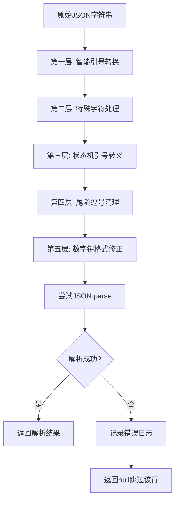

# JSON解析错误修复方案（增强版）

## 问题分析

### 错误现象
```
SyntaxError: Expected ',' or '}' after property value in JSON at position 59
```

### 问题根因
AI生成的JSON字符串值中包含**未转义的双引号**，例如：
```json
{"3":"中原最强大的世俗政权，以武立国，民风彪悍，秉持"谁欺负我就打谁"的信念..."}
```

在上述例子中，`"谁欺负我就打谁"` 中的双引号没有被转义，导致JSON解析器认为字符串在 `秉持"` 处就结束了。

### 当前代码位置
- 文件：[`index.js`](index.js:25851-25865)
- 函数：`parseTableEditCommandLine_ACU`

### 当前sanitization逻辑的问题
```javascript
sanitizedJson.replace(/(:\s*)"((?:\\.|[^"\\])*)"/g, (match, prefix, content) => {
    return `${prefix}"${content.replace(/(?<!\\)"/g, '\\"')}"`;
});
```

这个正则表达式的问题是：
1. `"((?:\\.|[^"\\])*)"` 只能匹配"正确的"JSON字符串（内部引号已转义）
2. 当字符串中间有未转义引号时，它会在第一个引号处停止匹配
3. 无法正确处理包含未转义引号的字符串

## 解决方案：多层Sanitization Pipeline

采用**分层清洗策略**，按优先级处理各类JSON错误：

### Sanitization Pipeline 流程图



### 第一层：智能引号转换

处理中文引号、全角引号等非标准引号：

```javascript
/**
 * 第一层：将中文引号、全角引号转换为标准双引号
 * @param {string} jsonStr - 原始JSON字符串
 * @returns {string} - 处理后的JSON字符串
 */
function normalizeQuotesLayer_ACU(jsonStr) {
    // 中文引号映射表
    const quoteMap = {
        '"': '"',  // 中文左双引号
        '"': '"',  // 中文右双引号
        '「': '"', // 日文/中文左引号
        '」': '"', // 日文/中文右引号
        '『': '"', // 中文左双引号（竖排）
        '』': '"', // 中文右双引号（竖排）
        '＂': '"', // 全角双引号
    };
    
    let result = jsonStr;
    for (const [from, to] of Object.entries(quoteMap)) {
        result = result.replace(new RegExp(from, 'g'), to);
    }
    
    return result;
}
```

### 第二层：特殊字符处理

处理换行符、制表符等控制字符：

```javascript
/**
 * 第二层：处理JSON字符串值中的特殊字符
 * @param {string} jsonStr - 原始JSON字符串
 * * @returns {string} - 处理后的JSON字符串
 */
function sanitizeControlCharsLayer_ACU(jsonStr) {
    // 使用状态机识别字符串边界，只处理字符串内部的控制字符
    let result = '';
    let inString = false;
    let escapeNext = false;
    
    for (let i = 0; i < jsonStr.length; i++) {
        const char = jsonStr[i];
        
        if (escapeNext) {
            result += char;
            escapeNext = false;
            continue;
        }
        
        if (char === '\\') {
            result += char;
            if (inString) {
                escapeNext = true;
            }
            continue;
        }
        
        if (char === '"') {
            result += char;
            inString = !inString;
            continue;
        }
        
        // 只在字符串内部处理控制字符
        if (inString) {
            if (char === '\n') {
                result += '\\n';
            } else if (char === '\r') {
                result += '\\r';
            } else if (char === '\t') {
                result += '\\t';
            } else if (char === '\0') {
                result += '\\u0000';
            } else {
                result += char;
            }
        } else {
            result += char;
        }
    }
    
    return result;
}
```

### 第三层：状态机引号转义（核心）

使用状态机识别字符串边界，转义字符串内部的未转义引号：

```javascript
/**
 * 第三层：转义JSON字符串值中的未转义双引号
 * 使用状态机遍历，确保只处理字符串值内部的引号
 * @param {string} jsonStr - 原始JSON字符串
 * @returns {object} - { success: boolean, result: string, error: string }
 */
function escapeUnescapedQuotesLayer_ACU(jsonStr) {
    if (typeof jsonStr !== 'string') {
        return { success: false, result: jsonStr, error: 'Input is not a string' };
    }
    
    let result = '';
    let inString = false;
    let escapeNext = false;
    let i = 0;
    
    try {
        while (i < jsonStr.length) {
            const char = jsonStr[i];
            
            if (escapeNext) {
                result += char;
                escapeNext = false;
                i++;
                continue;
            }
            
            if (char === '\\') {
                result += char;
                if (inString) {
                    escapeNext = true;
                }
                i++;
                continue;
            }
            
            if (char === '"') {
                if (!inString) {
                    // 不在字符串内，这是字符串开始引号
                    result += char;
                    inString = true;
                } else {
                    // 在字符串内，检查这是否是字符串结束引号
                    // 向前看，跳过空白，找到下一个结构字符
                    let j = i + 1;
                    while (j < jsonStr.length && /\s/.test(jsonStr[j])) {
                        j++;
                    }
                    
                    if (j >= jsonStr.length) {
                        // JSON结束，这是字符串结束引号
                        result += char;
                        inString = false;
                    } else {
                        const nextChar = jsonStr[j];
                        // JSON结构字符：冒号、逗号、右括号
                        if (nextChar === ':' || nextChar === ',' || 
                            nextChar === '}' || nextChar === ']') {
                            // 这是字符串结束引号
                            result += char;
                            inString = false;
                        } else {
                            // 这是字符串内部的未转义引号，需要转义
                            result += '\\"';
                            logWarn_ACU(`[Sanitization] Escaped unescaped quote at position ${i}`);
                        }
                    }
                }
                i++;
                continue;
            }
            
            // 其他字符直接追加
            result += char;
            i++;
        }
        
        // 检查最终状态
        if (inString) {
            logWarn_ACU(`[Sanitization] JSON ended while still in string mode`);
        }
        
        return { success: true, result, error: null };
    } catch (e) {
        return { success: false, result: jsonStr, error: e.message };
    }
}
```

### 第四层：尾随逗号清理

移除对象和数组中的尾随逗号：

```javascript
/**
 * 第四层：移除JSON中的尾随逗号
 * @param {string} jsonStr - 原始JSON字符串
 * @returns {string} - 处理后的JSON字符串
 */
function removeTrailingCommasLayer_ACU(jsonStr) {
    // 移除对象中的尾随逗号: ,} → }
    let result = jsonStr.replace(/,\s*}/g, '}');
    // 移除数组中的尾随逗号: ,] → ]
    result = result.replace(/,\s*\]/g, ']');
    return result;
}
```

### 第五层：数字键格式修正

将 `"0":` 格式修正为标准JSON格式（虽然 `"0":` 本身是合法的，但有时AI会输出 `0:` 不带引号）：

```javascript
/**
 * 第五层：修正数字键格式
 * @param {string} jsonStr - 原始JSON字符串
 * @returns {string} - 处理后的JSON字符串
 */
function fixNumericKeysLayer_ACU(jsonStr) {
    // 将不带引号的数字键修正为带引号的格式
    // 例如: {0:"value"} → {"0":"value"}
    // 注意：只处理对象键，不处理数组索引
    let result = jsonStr.replace(/([{,]\s*)(\d+)(\s*:)/g, (match, prefix, num, colon) => {
        return `${prefix}"${num}"${colon}`;
    });
    return result;
}
```

### 统一Pipeline函数

```javascript
/**
 * JSON Sanitization Pipeline - 统一入口
 * 按顺序执行所有清洗层
 * @param {string} jsonStr - 原始JSON字符串
 * @returns {object} - { success: boolean, result: string, layersApplied: string[], error: string }
 */
function sanitizeJsonPipeline_ACU(jsonStr) {
    if (typeof jsonStr !== 'string') {
        return { success: false, result: jsonStr, layersApplied: [], error: 'Input is not a string' };
    }
    
    const layersApplied = [];
    let current = jsonStr;
    
    try {
        // 第一层：智能引号转换
        const afterLayer1 = normalizeQuotesLayer_ACU(current);
        if (afterLayer1 !== current) {
            layersApplied.push('normalizeQuotes');
        }
        current = afterLayer1;
        
        // 第二层：特殊字符处理
        const afterLayer2 = sanitizeControlCharsLayer_ACU(current);
        if (afterLayer2 !== current) {
            layersApplied.push('sanitizeControlChars');
        }
        current = afterLayer2;
        
        // 第三层：状态机引号转义（核心）
        const layer3Result = escapeUnescapedQuotesLayer_ACU(current);
        if (!layer3Result.success) {
            return { success: false, result: current, layersApplied, error: layer3Result.error };
        }
        if (layer3Result.result !== current) {
            layersApplied.push('escapeUnescapedQuotes');
        }
        current = layer3Result.result;
        
        // 第四层：尾随逗号清理
        const afterLayer4 = removeTrailingCommasLayer_ACU(current);
        if (afterLayer4 !== current) {
            layersApplied.push('removeTrailingCommas');
        }
        current = afterLayer4;
        
        // 第五层：数字键格式修正
        const afterLayer5 = fixNumericKeysLayer_ACU(current);
        if (afterLayer5 !== current) {
            layersApplied.push('fixNumericKeys');
        }
        current = afterLayer5;
        
        return { success: true, result: current, layersApplied, error: null };
    } catch (e) {
        return { success: false, result: jsonStr, layersApplied, error: e.message };
    }
}
```

## 修改计划

### 修改位置

| 位置 | 行号区间 | 说明 |
|------|----------|------|
| 新增函数 | 约25800-25830 | 在 `parseTableEditCommandLine_ACU` 之前新增所有sanitization层函数 |
| 修改sanitization逻辑 | 25851-25865 | 替换现有的正则替换逻辑，调用 `sanitizeJsonPipeline_ACU` |

### 修改后的代码结构

```javascript
// ============ JSON Sanitization Pipeline ============
// 在 parseTableEditCommandLine_ACU 函数之前新增

const normalizeQuotesLayer_ACU = (jsonStr) => { ... };
const sanitizeControlCharsLayer_ACU = (jsonStr) => { ... };
const escapeUnescapedQuotesLayer_ACU = (jsonStr) => { ... };
const removeTrailingCommasLayer_ACU = (jsonStr) => { ... };
const fixNumericKeysLayer_ACU = (jsonStr) => { ... };
const sanitizeJsonPipeline_ACU = (jsonStr) => { ... };

// ============ 原有函数修改 ============
const parseTableEditCommandLine_ACU = (rawLine) => {
    try {
        // ... 前面的代码保持不变
        
        try {
            const jsonData = JSON.parse(jsonPart);
            args = [...initialArgs, jsonData];
        } catch (jsonError) {
            logError_ACU(`Primary JSON parse failed for: "${jsonPart.substring(0, 100)}...". Attempting sanitization pipeline...`, jsonError);
            
            // 使用新的sanitization pipeline
            const sanitizeResult = sanitizeJsonPipeline_ACU(jsonPart);
            
            if (sanitizeResult.success) {
                try {
                    const jsonData = JSON.parse(sanitizeResult.result);
                    args = [...initialArgs, jsonData];
                    if (sanitizeResult.layersApplied.length > 0) {
                        logInfo_ACU(`[Sanitization] Successfully applied layers: ${sanitizeResult.layersApplied.join(', ')}`);
                    }
                } catch (secondError) {
                    logError_ACU(`Secondary JSON parse also failed after sanitization. Layers applied: ${sanitizeResult.layersApplied.join(', ')}`, secondError);
                    logError_ACU(`Sanitized JSON preview: "${sanitizeResult.result.substring(0, 150)}..."`);
                    return null;
                }
            } else {
                logError_ACU(`Sanitization pipeline failed: ${sanitizeResult.error}`);
                return null;
            }
        }
        
        // ... 后面的代码保持不变
    } catch (e) {
        logError_ACU(`Failed to parse command line: "${rawLine}"`, e);
        return null;
    }
};
```

## 测试用例

### 测试1：未转义引号
**输入：**
```json
{"3":"中原最强大的世俗政权，以武立国，民风彪悍，秉持"谁欺负我就打谁"的信念"}
```

**预期输出：**
```json
{"3":"中原最强大的世俗政权，以武立国，民风彪悍，秉持\"谁欺负我就打谁\"的信念"}
```

### 测试2：中文引号
**输入：**
```json
{"name":"这是"中文引号"测试"}
```

**预期输出：**
```json
{"name":"这是\"中文引号\"测试"}
```

### 测试3：尾随逗号
**输入：**
```json
{"0":"value1","1":"value2",}
```

**预期输出：**
```json
{"0":"value1","1":"value2"}
```

### 测试4：换行符
**输入：**
```json
{"desc":"这是第一行
这是第二行"}
```

**预期输出：**
```json
{"desc":"这是第一行\\n这是第二行"}
```

### 测试5：综合测试（实际错误案例）
**输入：**
```json
{"0":"大唐帝国","1":"王朝","2":"顶级","3":"中原最强大的世俗政权，以武立国，民风彪悍，秉持"谁欺负我就打谁"的信念，国力强盛，统一中原大片区域，是对抗西陵神殿的核心力量","4":"大唐皇帝,李渔,夏侯","5":"主角所属的世俗政权，是对抗西陵的核心阵营","6":"一直维持中原统一稳定，最终和书院一同击败西陵，保持了独立统治"}
```

**预期输出：**
```json
{"0":"大唐帝国","1":"王朝","2":"顶级","3":"中原最强大的世俗政权，以武立国，民风彪悍，秉持\"谁欺负我就打谁\"的信念，国力强盛，统一中原大片区域，是对抗西陵神殿的核心力量","4":"大唐皇帝,李渔,夏侯","5":"主角所属的世俗政权，是对抗西陵的核心阵营","6":"一直维持中原统一稳定，最终和书院一同击败西陵，保持了独立统治"}
```

## 风险评估

1. **性能影响**：多层sanitization是O(n)复杂度，对大JSON字符串影响可忽略
2. **误转义风险**：状态机算法通过向前查看结构字符来判断引号类型，误转义概率极低
3. **兼容性**：新函数不影响现有的sanitization逻辑，只是作为增强补充
4. **日志追踪**：每层处理都会记录，便于调试和监控AI输出质量

## 后续优化建议

1. **提示词层面优化**：在AI填表提示词中明确要求：
   - JSON字符串值中的双引号必须转义为 `\"`
   - 不要在JSON值中使用换行符，改用 `\\n`
   - 确保每个JSON对象完整闭合

2. **监控统计**：记录sanitization成功率，用于监控AI输出质量：
   ```javascript
   // 可选：添加统计计数器
   window.acuSanitizationStats = {
       totalAttempts: 0,
       successfulSanitizations: 0,
       layersUsed: {}
   };
   ```

3. **扩展规则**：可根据实际错误案例继续扩展sanitization层：
   - 处理Unicode转义错误
   - 处理缺失的右括号
   - 处理重复的键名