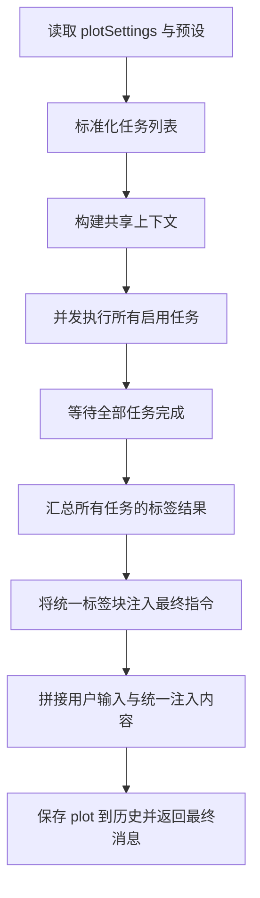

# 剧情推进多任务并发改造设计方案

## 1. 当前结论

- 项目中已存在 `README.md`，因此本轮无需新建。
- 当前剧情推进主流程集中在 `index.js` 中的单任务链路：
  - 默认剧情推进配置：约 `1891-1949`
  - 默认提示词组：约 `1951-2009`
  - 预设切换与导入导出：约 `6235-6660`
  - 运行时规划与标签提取注入：约 `12847-13090`
  - 剧情推进 UI 与预设保存读取：约 `21292-24608`
- 现状是“单个 promptGroup -> 单次 API 调用 -> 单次标签摘取 -> 直接拼接 finalSystemDirective 注入主模型”。
- 你的目标是把它改成“单个剧情推进预设下可配置多个并发任务；每个任务有独立提示词组和独立标签提取规则；所有任务完成后统一汇总标签，再注入用户输入”。

---

## 2. 推荐方案总览

### 2.1 设计原则

1. **保持旧预设兼容**
   - 旧数据只有 `promptGroup + extractTags + finalSystemDirective`。
   - 新版本自动把旧结构包装成一个默认任务，不破坏既有预设。

2. **任务级职责清晰**
   - 每个任务负责：构建消息、调用 API、提取标签、返回结构化结果。
   - 聚合层负责：等待全部任务完成、合并标签、组装最终注入文本。

3. **运行时并发，配置上串联**
   - UI 中允许定义多个任务。
   - 运行时用 `Promise.all` 或等价并发收集所有任务结果。
   - 最终只做一次统一注入，避免任务之间互相覆盖用户输入。

4. **失败可控**
   - 任务可以单独失败并上报。
   - 聚合层决定是“任一失败则整体失败”，还是“允许部分成功继续注入”。
   - 首版建议采用：**默认任一任务失败则整体重试**，逻辑最稳，方便保证输出完整性。

---

## 3. 推荐数据结构

### 3.1 在剧情推进设置中新增任务数组

建议在现有 `plotSettings` 和剧情推进预设对象内新增字段：

```js
plotTasks: [
  {
    id: 'recallTask',
    name: '记忆召回任务',
    enabled: true,
    promptGroup: [...],
    extractTags: 'recall,supplement',
    finalDirectiveTemplate: '',
    minLength: 0,
    maxRetries: 3,
    mergeStrategy: 'append',
    order: 0
  }
]
```

### 3.2 字段说明

- `id`
  - 稳定标识，用于保存、导入导出、调试日志。
- `name`
  - UI 展示名，例如“记忆召回”“剧情走向”“情绪分析”。
- `enabled`
  - 是否参与本轮并发执行。
- `promptGroup`
  - 该任务独立的提示词组。
- `extractTags`
  - 该任务独立的标签摘取规则。
- `finalDirectiveTemplate`
  - 可选，任务级模板。首版可不启用拼接，只先保留字段，为后续扩展预留。
- `minLength`
  - 任务自己的最短回复长度阈值。
- `maxRetries`
  - 任务自己的重试次数；若未配置则回退全局值。
- `mergeStrategy`
  - 预留字段，首版建议只支持 `append`。
- `order`
  - 聚合时的稳定顺序。

### 3.3 顶层字段保留策略

以下旧字段继续保留，作为兼容层与全局层：

- `promptGroup`
- `extractTags`
- `finalSystemDirective`
- `minLength`
- `loopSettings.maxRetries`

规则建议如下：

- 如果存在 `plotTasks` 且有启用任务，则运行新链路。
- 如果不存在 `plotTasks`，则自动构造一个兼容任务：
  - `promptGroup = plotSettings.promptGroup`
  - `extractTags = plotSettings.extractTags`
  - `minLength = plotSettings.minLength`
  - `maxRetries = plotSettings.loopSettings.maxRetries`

这样旧预设无需手工迁移也能直接运行。

---

## 4. 运行时流程设计

### 4.1 新流程



### 4.2 共享上下文与任务私有上下文

**共享上下文** 只构造一次，避免重复开销：

- `$1` 世界书内容
- `$5` 大纲内容
- `$6` 上轮 plot
- `$7` 上文 AI 内容
- `$8` 当前用户输入
- `$U` 用户设定
- `$C` 角色设定
- 条件模板检测上下文

**任务私有上下文** 在共享上下文之上叠加：

- 任务自己的 `promptGroup`
- 任务自己的 `extractTags`
- 任务自己的 `minLength`
- 任务自己的 `maxRetries`
- 任务自己的日志前缀

### 4.3 任务执行结果结构

建议每个任务返回统一结果：

```js
{
  taskId: 'recallTask',
  taskName: '记忆召回任务',
  success: true,
  rawResponse: '...',
  extractedTags: {
    recall: '...',
    supplement: '...'
  },
  injectedFragments: [
    '<recall>...</recall>',
    '<supplement>...</supplement>'
  ],
  error: null
}
```

这样聚合层不用再重新解析每个任务的回复文本结构。

---

## 5. 标签汇总与统一注入设计

### 5.1 现状问题

当前逻辑在单次任务执行后立刻做标签摘取，并直接拼接到最终消息中。这样会导致：

- 无法并发多个任务后再统一注入。
- 不同任务如果输出同名标签，缺乏合并规则。
- `finalSystemDirective` 只能感知单次规划的结果。

### 5.2 新的汇总规则

建议新增统一聚合器，步骤如下：

1. 收集每个任务的 `extractedTags`
2. 按任务顺序聚合到 `Map<tagName, Array<fragment>>`
3. 对同名标签默认按顺序拼接
4. 生成统一标签块
5. 再把统一标签块注入到 `finalSystemDirective`

### 5.3 同名标签合并策略

首版建议采用最稳妥规则：

- **同名标签允许多任务贡献内容**
- 聚合格式：

```xml
<recall>
任务A内容

任务B内容
</recall>
```

如果你更希望保留来源，也可以升级为：

```xml
<recall>
<task name="记忆召回任务">
...
</task>
<task name="剧情走向任务">
...
</task>
</recall>
```

但首版不建议引入额外嵌套过多，先走简单拼接更稳。

### 5.4 与最终注入指令的结合方式

推荐把全局 `finalSystemDirective` 定义为统一注入入口，不让每个任务各自直连主模型。

新的拼接顺序建议为：

1. 全局 `finalSystemDirective`
2. 统一标签块
3. 若未提取出任何标签，则回退拼接所有任务原始回复或可配置摘要

这样就满足“所有任务完成后统一提取标签并注入用户输入里”。

---

## 6. 预设结构改造方案

### 6.1 新预设格式

建议剧情推进预设新增：

```json
{
  "name": "默认预设",
  "plotTasks": [
    {
      "id": "recallTask",
      "name": "记忆召回",
      "enabled": true,
      "promptGroup": [],
      "extractTags": "recall,supplement",
      "minLength": 0,
      "maxRetries": 3,
      "order": 0
    },
    {
      "id": "plotTask",
      "name": "剧情走向",
      "enabled": true,
      "promptGroup": [],
      "extractTags": "plot,thinking",
      "minLength": 0,
      "maxRetries": 3,
      "order": 1
    }
  ],
  "finalSystemDirective": "...",
  "rateMain": 1,
  "ratePersonal": 1,
  "rateErotic": 0,
  "rateCuckold": 1,
  "recallCount": 20
}
```

### 6.2 兼容旧预设的迁移规则

当导入或切换预设时：

- 若检测到 `plotTasks` 存在且有效，直接使用。
- 若 `plotTasks` 不存在，则自动生成一个默认任务：
  - `id = 'defaultTask'`
  - `name = '默认任务'`
  - `promptGroup = 旧 promptGroup`
  - `extractTags = 旧 extractTags`
  - `minLength = 旧 minLength`
  - `maxRetries = loopSettings.maxRetries`

这部分兼容需要覆盖：

- 预设切换
- 预设导入
- 预设导出
- UI 加载
- UI 保存

---

## 7. 建议调整的核心代码区域

### 7.1 配置默认值区

目标：在默认剧情推进设置里加入 `plotTasks` 默认结构。

涉及区域：

- `index.js` 约 `1891-1949`
- `index.js` 约 `1951-2009`
- `index.js` 约 `4964-5027`

建议动作：

1. 新增构建默认任务列表的方法。
2. 让默认预设包含至少一个默认任务。
3. 保留旧 `promptGroup` 字段，作为兼容层，不立即删除。

### 7.2 预设管理 API

目标：让预设的读取、切换、导入导出都支持 `plotTasks`。

涉及区域：

- `index.js` 约 `6235-6660`
- `index.js` 约 `24420-24523`
- `index.js` 约 `23290-23360`

建议动作：

1. 新增 `normalizePlotTasks_ACU` 一类的标准化方法。
2. 在 `switchPlotPreset` 中优先应用 `plotTasks`。
3. 在导入导出时保留 `plotTasks`，并对旧格式自动补齐。

### 7.3 运行时规划逻辑

目标：把单任务执行改造成共享上下文 + 多任务并发 + 聚合注入。

涉及区域：

- `index.js` 约 `12847-13090`

建议动作：

1. 把“单段 promptGroup 渲染”抽成独立函数。
2. 把“单任务 API 调用 + 重试 + 标签提取”抽成独立函数。
3. 新增并发调度器，统一 `await` 所有任务。
4. 新增标签聚合器，将结果注入最终消息。
5. 继续复用现有 `savePlotToLatestMessage_ACU`，但存储内容建议改为聚合后的总结果，必要时附带任务明细。

### 7.4 UI 区

目标：让一个预设下可以配置多个任务，而不是只有一个顶层提示词组。

涉及区域：

- `index.js` 约 `21292-21470`
- `index.js` 约 `22876-23060`
- `index.js` 约 `24069-24608`

建议动作：

1. 新增任务列表容器。
2. 支持新增任务、删除任务、启用禁用、拖拽排序或上下移动。
3. 每个任务卡片内包含：
   - 任务名
   - 独立提示词组编辑器
   - 独立标签摘取配置
   - 独立最短长度 / 重试次数
4. 顶层 `finalSystemDirective` 仍保留为统一注入入口。

---

## 8. 推荐新增的函数拆分

为避免把现有单个大函数继续做大，建议拆出以下函数：

### 8.1 数据标准化层

- `buildDefaultPlotTask_ACU`
- `buildDefaultPlotTasks_ACU`
- `normalizePlotTask_ACU`
- `normalizePlotTasks_ACU`
- `ensurePlotTasks_ACU`
- `convertLegacyPlotSettingsToTasks_ACU`

### 8.2 运行时执行层

- `buildSharedPlotRuntimeContext_ACU`
- `renderPlotTaskMessages_ACU`
- `runSinglePlotTask_ACU`
- `extractTaskTags_ACU`
- `mergePlotTaskResults_ACU`
- `buildFinalPlotInjection_ACU`

### 8.3 UI 层

- `renderPlotTasksEditor_ACU`
- `renderSinglePlotTaskEditor_ACU`
- `readPlotTasksFromUI_ACU`
- `savePlotTasksFromUI_ACU`
- `resetPlotTasksToDefault_ACU`

这样能把原先集中在一段内的职责拆开，后续更容易维护。

---

## 9. 并发执行边界与风险控制

### 9.1 首版建议的并发边界

建议只对“剧情推进内部的多个子任务”并发，不扩大到以下范围：

- 不并发世界书读取
- 不并发上下文提取
- 不并发 `savePlotToLatestMessage_ACU`
- 不并发主模型最终生成

也就是：**共享上下文串行准备一次，子任务请求并发，最终注入串行收尾**。

### 9.2 为什么这样最稳

因为当前共享数据里包含：

- 随机标签处理
- 条件模板上下文
- 历史 plot 读取
- toast 状态更新
- 中止控制器

如果把上下文准备也并发化，容易出现：

- 重复读取世界书
- 多次更新同一个 toast
- 多任务共享随机变量导致不可预测
- 中止信号传播复杂化

### 9.3 中止控制

建议所有任务共享同一个 `abortController_ACU.signal`。

规则：

- 用户点击中止 -> 所有未完成任务一起取消。
- 任一任务抛出中止错误 -> 整个并发流程终止。

### 9.4 重试策略

首版建议采用“任务内独立重试，聚合层等待最终结果”：

- 每个任务单独按 `maxRetries` 重试。
- 某任务最终失败，则本轮整体视为失败。
- 不建议做“整体并发批次级重试”，否则容易重复请求已成功任务，浪费成本。

---

## 10. UI 交互设计建议

### 10.1 顶层布局调整

在当前“提示词设置”区下改为：

1. 任务列表工具栏
   - 新增任务
   - 恢复默认任务组
2. 任务卡片列表
3. 全局最终注入指令

### 10.2 单个任务卡片建议字段

- 任务名称
- 启用开关
- 标签摘取输入框
- 最短回复长度
- 最大重试次数
- 任务提示词组编辑器
- 删除按钮
- 排序按钮

### 10.3 向后兼容体验

打开旧配置时：

- UI 自动显示一个“默认任务”卡片
- 该任务内容来自旧 `promptGroup`
- 用户无需理解迁移过程，开箱即用

---

## 11. README 更新策略

你要求“每次更新完要将本次更新的内容与对应的代码行数区间记录上去”，这个要求完全可以沿用现有 `README.md` 的记录风格。

### 11.1 建议记录格式

每次实现后，在 `README.md` 追加一个新小节，包含：

1. 更新日期
2. 功能标题
3. 功能描述
4. 修改位置表

建议表头继续保持：

| 函数 / 场景 | 行号区间 | 说明 |
|------|------|------|

### 11.2 本次并发改造最终应记录的内容

建议最终在 `README.md` 记录至少这些块：

- 多任务并发剧情推进
- 任务级标签摘取与统一注入
- 旧预设自动迁移为默认任务
- UI 支持多任务编辑
- 预设导入导出兼容 `plotTasks`

### 11.3 行号记录原则

实现完成后，按最终实际文件行号填写，不写预估值。

---

## 12. 分阶段实施清单

### 阶段 1：数据层兼容改造

1. 新增任务默认结构与标准化函数
2. 给 `plotSettings` 增加 `plotTasks`
3. 给预设对象增加 `plotTasks`
4. 旧数据自动包装为默认任务

### 阶段 2：运行时并发执行

1. 抽离单任务渲染逻辑
2. 抽离单任务调用与重试逻辑
3. 使用并发调度执行多个任务
4. 聚合所有标签结果
5. 统一生成最终注入文本

### 阶段 3：预设管理兼容

1. 预设切换支持 `plotTasks`
2. 预设导入支持 `plotTasks`
3. 预设导出保留 `plotTasks`
4. UI 加载和保存支持 `plotTasks`

### 阶段 4：UI 改造

1. 增加任务列表编辑器
2. 支持任务增删改排序
3. 支持任务级标签提取和提示词组
4. 保留全局最终注入指令

### 阶段 5：README 记录

1. 记录功能摘要
2. 记录所有关键修改区间
3. 标明兼容旧预设与统一注入机制

---

## 13. 我建议的落地顺序

如果下一步切到实现模式，我会建议按以下顺序改：

1. 先补数据结构与兼容函数
2. 再改运行时并发主链路
3. 然后补预设切换与导入导出
4. 最后再做 UI 多任务编辑器
5. 收尾更新 `README.md`

这样做的好处是：

- 核心能力先稳定
- UI 改造不会反复返工
- 兼容旧配置的验证路径更清晰

---

## 14. 结论

这次改造最关键的不是简单把单次 API 调用改成并发，而是要把当前“单任务直出文本”的链路升级成：

- **任务标准化**
- **共享上下文**
- **任务级并发执行**
- **任务级标签提取**
- **统一标签聚合**
- **统一最终注入**

这是最符合你目标、且最不容易把旧逻辑改炸的方案。

下一阶段进入实现时，优先改运行时链路与兼容层，再补 UI 和 README 记录。