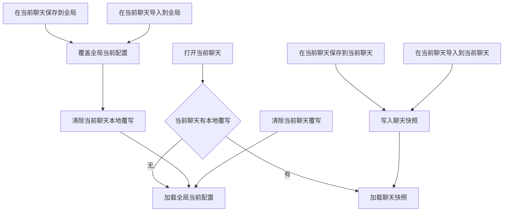

# 剧情推进预设与表格模板双轨作用域方案

## 这轮最新结论

- 项目里已经有 [`README.md`](../README.md)，本轮无需新建。
- 用户已明确确认：当前聊天保存采用聊天级覆写快照，而不是差异层。
- [`index.js`](../index.js) 里的剧情推进预设与表格模板，都要拆成两个并列显示区：
  - 全局正在使用
  - 当前聊天正在使用
- 两个区都要有保存、导入、导出能力，但作用域必须严格分开。
- 当前聊天在没有本地覆写时，必须直接跟随当前全局配置，而不是偷偷复制一份后冻结。
- 在当前聊天里执行“保存到全局”或“导入到全局”后，当前聊天对应作用域的本地覆写标记要被清除，这样当前聊天会立刻改为使用新的全局配置。
- 在当前聊天里执行“保存到当前聊天”或“导入到当前聊天”后，只写聊天记录，不覆盖全局。
- API 侧要与 UI 的双作用域语义对齐，但剧情推进**不再提供全局 API**；剧情推进只保留当前聊天级公开接口，并把现有 [`switchPlotPreset()`](../index.js#L6998-L7015) 改成当前聊天级语义。

---

## 一、为什么现状已经不够用

### 1. 剧情推进目前仍以设置存储为主，不是聊天记录存储

当前剧情推进的主入口还是 [`applyPlotPresetSelectionForCurrentChat_ACU()`](../index.js#L4747-L4775) 与 [`loadPresetAndCleanCharacterData_ACU()`](../index.js#L13145-L13196)。

现状问题：

- 当前聊天绑定主要通过设置层的 `plotPresetBindings` 维护，而不是聊天记录里的完整快照。
- 绑定里主要保存的是预设名，不是完整运行态配置。
- 这只能表达 当前聊天选了哪个全局预设，不能表达 当前聊天已经脱离全局，拥有自己的独立快照。

这和你现在要求的 聊天级独立保存 直接冲突。

### 2. 表格模板当前只有全局当前值，没有聊天级模板快照

模板当前值主要依赖：

- [`getCurrentTemplatePresetName_ACU()`](../index.js#L1310-L1315)
- [`persistCurrentTemplatePresetName_ACU()`](../index.js#L1317-L1324)
- [`saveCurrentProfileTemplate_ACU()`](../index.js#L1591-L1594)
- [`applyTemplatePresetToCurrent_ACU()`](../index.js#L1477-L1514)

现状问题：

- 全局当前模板能保存。
- 当前聊天实际使用的模板，并没有一套独立且显式的 聊天级模板快照 概念。
- [`overwriteChatSheetGuideFromTemplate_ACU()`](../index.js#L9194-L9202) 会把模板写成聊天指导表，但它更像派生运行数据，不是明确建模的 聊天模板作用域。

### 3. 现有指导表机制会让聊天很容易悄悄冻结

[`saveIndependentTableToChatHistory_ACU()`](../index.js#L18379-L18540) 在首次填表后会创建聊天级指导表。

这意味着：

- 很多聊天其实已经拥有本地模板痕迹。
- 但 UI 没有明确告诉用户 这是继承全局 还是 聊天覆写。
- 之后全局模板改了，老聊天到底该不该跟着变，语义已经不清晰。

这正是这轮要彻底收敛的点。

---

## 二、统一设计原则

这轮建议把剧情推进与表格模板都统一成下面这套模型。

### 统一原则 1：永远区分 全局当前配置 和 当前聊天实际配置

- 全局当前配置：用于新聊天默认继承，也是全局区显示的对象。
- 当前聊天实际配置：当前聊天最终真正使用的对象，也是聊天区显示的对象。

### 统一原则 2：当前聊天实际配置的解析顺序固定

对剧情推进和表格模板都统一为：

1. 如果当前聊天有本地覆写快照，则使用聊天快照。
2. 如果当前聊天没有本地覆写快照，则直接使用当前全局配置。

也就是：

- 当前聊天配置 = 聊天覆写快照 ?? 全局当前配置

### 统一原则 3：聊天级保存永远是完整快照，不依赖全局同名预设

用户已经确认当前聊天保存采用完整快照，因此：

- 不能只记一个 `presetName`
- 不能只记 我是基于哪个全局预设 改出来的
- 必须把当前编辑器里的完整配置直接写进聊天记录

### 统一原则 4：全局保存会吞掉当前聊天覆写

当用户在当前聊天里点击 全局保存 时，语义必须是：

1. 以当前编辑器状态覆盖全局当前配置
2. 清除当前聊天对此作用域的本地覆写标记
3. 当前聊天立刻回到 跟随全局

这样不会出现：

- 全局已经改了
- 当前聊天还挂着一份和全局内容一模一样的冗余本地快照

### 统一原则 5：API 不能混淆作用域

这轮之后，API 必须和 UI 一样显式区分作用域。

但这里再细分一条：

- 剧情推进的**公开 API**只保留当前聊天级能力
- 剧情推进的全局保存、全局导入、全局恢复默认仍然保留在 UI 和内部 helper 中，不再额外暴露成公开 API
- 表格模板可以保留双作用域 API，因为模板本来就和外部导入导出链路耦合更深

---

## 三、推荐的统一状态机



这个状态机对剧情推进与表格模板都成立。

---

## 四、数据模型设计

## 1. 全局层数据

### 1.1 剧情推进全局层

继续保留并复用：

- [`settings_ACU.plotSettings.promptPresets`](../index.js#L24247-L24256)
- [`settings_ACU.plotSettings.lastUsedPresetName`](../index.js#L14349-L14352)

建议新增：

- `settings_ACU.plotSettings.globalRevision`

语义：

- 当前全局正在使用的剧情推进预设名，继续由 `lastUsedPresetName` 表示。
- 每次全局保存、全局导入、全局恢复默认，递增 `globalRevision`。
- 聊天快照可记录它当时基于哪个 `globalRevision` 生成，但这只是诊断信息，不参与运行时合成。

### 1.2 表格模板全局层

继续保留并复用：

- [`TABLE_TEMPLATE_ACU`](../index.js#L1507-L1509)
- [`saveCurrentProfileTemplate_ACU()`](../index.js#L1591-L1594)
- [`settings_ACU.currentTemplatePresetName`](../index.js#L14349-L14350)

建议新增：

- `settings_ACU.templateGlobalRevision`

语义：

- `TABLE_TEMPLATE_ACU` 仍是当前全局正在使用的模板正文。
- `currentTemplatePresetName` 仍是当前全局模板对应的预设名或默认预设标识。
- 每次全局保存、全局导入、全局恢复默认，递增 `templateGlobalRevision`。

---

## 2. 聊天层数据

这轮不建议继续把聊天级作用域状态塞在设置存储里，而应转到聊天记录本身。

建议新增统一聊天容器，例如：

```js
TavernDB_ACU_ScopedConfig = {
  plot: {
    mode: 'inherit_global' | 'chat_override',
    snapshot: { ...完整剧情推进配置... },
    originGlobalName: 'xxx',
    originGlobalRevision: 12,
    updatedAt: 1710000000000,
    source: 'ui_save' | 'ui_import' | 'api_import'
  },
  template: {
    [isolationKey]: {
      mode: 'inherit_global' | 'chat_override' | 'legacy_frozen',
      templateStr: '{...}',
      presetName: 'xxx',
      guideData: { ...可选缓存... },
      originGlobalName: 'xxx',
      originGlobalRevision: 8,
      updatedAt: 1710000000000,
      source: 'ui_save' | 'ui_import' | 'api_import'
    }
  }
}
```

### 2.1 为什么剧情推进也要进聊天记录

因为这轮你要求的是：

- 当前聊天保存不影响全局
- 并且这个聊天级保存应该跟随聊天一起存在

如果继续只放在 `settings_ACU.plotPresetBindings`，那它仍然属于插件设置，不是真正的聊天内快照。

因此建议：

- `plotPresetBindings` 在迁移期保留为旧数据兼容层
- 新的剧情推进聊天级覆写，以聊天记录元数据为准

### 2.2 为什么模板聊天级覆写要按隔离键保存

表格模板当前本来就与隔离键体系高度相关，例如：

- [`overwriteChatSheetGuideFromTemplate_ACU()`](../index.js#L9194-L9202)
- [`saveIndependentTableToChatHistory_ACU()`](../index.js#L18379-L18540)

因此模板聊天级覆写不应只按 chatId 一层保存，建议继续挂在当前 `isolationKey` 下，避免同一聊天不同隔离槽互相污染。

---

## 五、运行时解析规则

## 1. 剧情推进的解析规则

### 1.1 全局当前配置

继续由：

- [`settings_ACU.plotSettings.lastUsedPresetName`](../index.js#L14349-L14352)

决定全局当前预设。

### 1.2 当前聊天实际配置

进入聊天时，推荐把 [`loadPresetAndCleanCharacterData_ACU()`](../index.js#L13145-L13196) 改为下面顺序：

1. 先读当前聊天元数据里的 `plot` 状态。
2. 如果 `mode === 'chat_override'` 且 `snapshot` 有效，直接把快照加载到 `settings_ACU.plotSettings`。
3. 否则，读取全局当前预设或默认预设，加载到 `settings_ACU.plotSettings`。
4. UI 的聊天区显示 当前聊天正在使用哪个来源。
5. UI 的全局区显示 全局当前预设。

### 1.3 旧字段如何兼容

如果聊天元数据还没有 `plot` 状态，但老的 `plotPresetBindings` 里有显式绑定，则：

- 如果它与当前全局值相同，可直接视为 `inherit_global`
- 如果它与当前全局值不同，则在首次进入该聊天时，把该旧绑定解析成完整配置，落成一次聊天快照，然后再逐步淘汰旧绑定

这样可以平滑迁移，不丢旧行为。

---

## 2. 表格模板的解析规则

### 2.1 全局当前配置

继续由下面两部分一起表达：

- 全局当前模板正文：[`saveCurrentProfileTemplate_ACU()`](../index.js#L1591-L1594) 对应的 profile 模板
- 全局当前模板预设名：[`settings_ACU.currentTemplatePresetName`](../index.js#L14349-L14350)

### 2.2 当前聊天实际配置

进入聊天时，模板应按下面顺序解析：

1. 先读取当前聊天当前隔离键下的模板作用域状态。
2. 若 `mode === 'chat_override'`，使用聊天快照 `templateStr` 作为当前聊天模板。
3. 若没有聊天覆写，则直接使用全局 `TABLE_TEMPLATE_ACU`。
4. 之后再决定是否需要重建聊天指导表。

### 2.3 现有指导表要降级为派生物，而不是作用域真相源

这轮最关键的修正之一是：

- 聊天级模板覆写的真相源应该是聊天模板快照本身
- 不是指导表

指导表应该只承担：

- 按当前有效模板生成的运行缓存
- 表顺序与参数结构的聊天内落地结果

不应该再被当作 聊天是否已经脱离全局 的唯一判据。

### 2.4 模板指导表需要补来源标记

建议为指导表元数据增加来源字段，例如：

- `sourceMode: inherit_global | chat_override | legacy_frozen`
- `globalRevision`

推荐规则：

- 新逻辑下，如果当前聊天没有本地模板覆写，指导表记为 `inherit_global`
- 如果用户保存到当前聊天或导入到当前聊天，指导表记为 `chat_override`
- 老版本遗留、没有来源字段的指导表，先按 `legacy_frozen` 处理，避免一升级就偷偷漂移

这会比直接强行把所有历史聊天都改成跟随全局更安全。

---

## 六、UI 设计建议

## 1. 剧情推进区

建议拆成两个卡片。

### 1.1 全局卡片

显示内容：

- 全局当前预设名
- 是否默认预设
- 若为命名预设，则仍可使用预设下拉框

按钮建议：

- 保存到全局
- 另存为全局预设
- 导入到全局
- 导出全局当前
- 恢复全局默认
- 删除当前全局命名预设

### 1.2 当前聊天卡片

显示内容：

- 当前聊天实际使用来源
  - 跟随全局
  - 聊天覆写
- 若为聊天覆写，可显示 来源全局名 与 更新时间

按钮建议：

- 保存到当前聊天
- 导入到当前聊天
- 导出当前聊天
- 清除当前聊天覆写

说明：

- 当前聊天卡片不需要维护一套聊天级预设库。
- 当前聊天只有一份有效快照，不做 聊天内多预设管理。

这会比再做一套聊天级下拉框更稳，也更好理解。

---

## 2. 表格模板区

同样拆成两个卡片。

### 2.1 全局卡片

显示内容：

- 全局当前模板预设名
- 是否默认预设

按钮建议：

- 保存到全局模板
- 另存为全局模板预设
- 导入到全局模板
- 导出全局模板
- 恢复全局默认模板
- 删除当前全局命名模板预设

### 2.2 当前聊天卡片

显示内容：

- 当前聊天模板来源
  - 跟随全局
  - 聊天覆写
  - 旧版冻结

按钮建议：

- 保存到当前聊天模板
- 导入到当前聊天模板
- 导出当前聊天模板
- 恢复跟随全局

并建议在卡片里明确提示：

- 当前聊天模板保存在聊天记录中
- 不会覆盖全局模板

---

## 七、操作语义矩阵

| 操作 | 作用域 | 数据落点 | 是否覆盖全局 | 是否覆盖当前聊天 | 备注 |
| --- | --- | --- | --- | --- | --- |
| 保存到全局 | 全局 | 设置存储 | 是 | 是 | 会清除当前聊天对应覆写，让当前聊天直接使用新全局 |
| 导入到全局 | 全局 | 设置存储 | 是 | 是 | 同上 |
| 导出全局当前 | 全局 | 文件 | 否 | 否 | 导出全局当前有效快照 |
| 恢复全局默认 | 全局 | 设置存储 | 是 | 是 | 同样清除当前聊天对应覆写 |
| 保存到当前聊天 | 当前聊天 | 聊天记录 | 否 | 是 | 写入完整快照 |
| 导入到当前聊天 | 当前聊天 | 聊天记录 | 否 | 是 | 写入完整快照 |
| 导出当前聊天 | 当前聊天 | 文件 | 否 | 否 | 导出当前聊天当前有效快照 |
| 清除当前聊天覆写 | 当前聊天 | 聊天记录 | 否 | 是 | 删除覆写后立即回退跟随全局 |

---

## 八、关键行为细化

## 1. 在当前聊天点击 保存到全局

### 1.1 剧情推进

建议流程：

1. 从 [`getCurrentPlotSettingsFromUI_ACU()`](../index.js#L25537-L25587) 抓取当前完整剧情推进配置。
2. 覆盖当前选中的全局预设；若当前全局是默认预设，则转成 另存为全局预设。
3. 更新 [`settings_ACU.plotSettings.lastUsedPresetName`](../index.js#L14349-L14352) 与 `plotGlobalRevision`。
4. 删除当前聊天在聊天记录中的 `plot.chat_override`。
5. 重新把全局当前配置加载到当前聊天运行态。
6. 刷新全局卡片与当前聊天卡片。

### 1.2 表格模板

建议流程：

1. 获取当前模板编辑器对应的完整模板快照。
2. 覆盖当前全局模板与当前全局模板预设名。
3. 保存到 [`saveCurrentProfileTemplate_ACU()`](../index.js#L1591-L1594) 对应的 profile 存储。
4. 递增 `templateGlobalRevision`。
5. 清除当前聊天当前隔离键下的模板覆写状态。
6. 以新的全局模板重建当前聊天指导表。
7. 刷新两张卡片。

## 2. 在当前聊天点击 保存到当前聊天

### 2.1 剧情推进

建议流程：

1. 抓取当前编辑器完整剧情推进配置。
2. 写入聊天记录元数据 `plot.mode = chat_override`。
3. 保存完整 `snapshot`。
4. 不改全局预设库，不改 `lastUsedPresetName`。
5. 当前聊天继续使用这份本地快照。

### 2.2 表格模板

建议流程：

1. 抓取当前模板编辑器完整模板正文。
2. 写入聊天记录元数据 `template[isolationKey].mode = chat_override`。
3. 保存完整 `templateStr`。
4. 同步重建当前聊天指导表，并标记 `sourceMode = chat_override`。
5. 不改全局模板与全局模板预设名。

## 3. 清除当前聊天覆写

剧情推进与模板都统一为：

1. 删除聊天记录里的本地快照。
2. 当前聊天回退到继承全局。
3. UI 状态改成 跟随全局。

其中模板还要额外：

4. 用全局模板重建当前聊天指导表，并标记 `sourceMode = inherit_global`。

---

## 九、API 设计建议

## 1. 剧情推进 API 只保留当前聊天级公开接口

这轮按你的最新要求收敛：

- 剧情推进**不再设计全局 API**
- 现有 [`switchPlotPreset()`](../index.js#L6998-L7015) 直接改成 当前聊天级切换
- 全局剧情推进的保存、导入、导出、恢复默认，继续由 UI 按钮和内部 helper 负责，不额外暴露公开 API

### 1.1 剧情推进 API 建议语义

推荐把现有 [`switchPlotPreset()`](../index.js#L6998-L7015) 改成：

- 只影响当前聊天
- 如果当前聊天此前无覆写，则创建聊天级覆写快照
- 不再修改全局当前预设
- 不再承担新聊天继承源更新职责

### 1.2 建议保留的剧情推进公开 API

```js
getPlotScopeState()
getCurrentPlotPreset()
switchPlotPreset(presetName)
savePlotPresetForCurrentChat()
importPlotPresetForCurrentChat(data)
exportPlotPresetForCurrentChat()
clearCurrentChatPlotOverride()
```

其中：

- [`switchPlotPreset()`](../index.js#L6998-L7015) 改语义后，等价于 `switchPlotPresetForCurrentChat`，只是为了兼容旧调用，保留原名字。
- `getPlotScopeState()` 负责把 全局当前值 与 当前聊天当前值 一起返回给 UI 或外部使用方。
- 全局剧情推进的公开 API 不再补充新增，避免和 UI 全局操作再次形成双语义入口。

## 2. 模板 API 保持双作用域更合适

模板这边仍建议保留双作用域接口，因为模板本身与导入导出、指导表重建、外部数据落盘链路耦合更深。

建议新增模板侧显式作用域接口，例如：

```js
getTemplateScopeState()
switchTemplatePresetGlobal(presetName)
saveTemplateGlobal(name)
importTemplateGlobal(data)
exportTemplateGlobal()

saveTemplateForCurrentChat()
importTemplateForCurrentChat(data)
exportTemplateForCurrentChat()
clearCurrentChatTemplateOverride()
```

### 2.1 推荐返回结构

无论剧情推进还是模板，`get...ScopeState()` 都建议统一返回：

```js
{
  global: {
    mode: 'default' | 'preset',
    name: 'xxx',
    revision: 12
  },
  chat: {
    mode: 'inherit_global' | 'chat_override' | 'legacy_frozen',
    displayName: '跟随全局: xxx',
    updatedAt: 1710000000000
  }
}
```

这样 UI 与外部调用都能直接知道两层状态，而不是自行猜测。

---

## 十、迁移策略

## 1. 剧情推进迁移

### 1.1 旧字段保留一轮兼容

- [`settings_ACU.plotPresetBindings`](../index.js#L14346-L14348) 先不立即删除。
- 加载聊天时优先读新聊天元数据。
- 如果新元数据不存在，再回退读取旧绑定。

### 1.2 首次进入时做按需迁移

建议规则：

- 旧绑定等于当前全局值：直接视为 `inherit_global`
- 旧绑定不同于当前全局值：把旧绑定解析成一份聊天快照后写入聊天记录
- 迁移成功后，可逐步清理该聊天对应旧绑定

## 2. 表格模板迁移

### 2.1 老指导表不要强行判定成继承全局

现有聊天如果已经有指导表，但没有新来源字段，最稳妥的是：

- 标记为 `legacy_frozen`
- 保持旧聊天当前结构不变
- 直到用户手动点击 恢复跟随全局模板，才切回新逻辑里的 `inherit_global`

这样不会出现升级后旧聊天结构突然漂移。

---

## 十一、需要重点防错的边界

## 1. 删除全局命名预设

### 1.1 剧情推进

- 如果删掉的是全局当前预设，则全局回退默认预设。
- 所有 跟随全局 的聊天也跟着回退。
- 所有 聊天覆写 的聊天不受影响，因为它们用的是完整快照。

### 1.2 表格模板

- 如果删掉的是全局当前模板预设，则全局回退默认模板。
- 跟随全局 的聊天跟着回退。
- 聊天覆写 与 `legacy_frozen` 不受影响。

## 2. 导出聊天快照时不能导出成引用

聊天导出必须导出当前有效完整快照，而不是：

- 只导出一个全局预设名
- 只导出一个模板预设名

否则导出的文件离开当前环境后就失效。

## 3. 全局保存时一定要清覆写，不然会留下假覆写

这是本轮最容易前后矛盾的点。

只要操作是 当前聊天里点击保存到全局，就必须：

- 同步清除当前聊天对应的覆写标记

否则当前聊天会出现：

- 看起来是本地覆写
- 实际内容却和全局完全相同

这会让 UI 与后续逻辑都很混乱。

## 4. 模板聊天覆写与指导表重建必须同步

模板聊天快照一旦变更：

- 指导表必须同步重建
- 并写入正确 `sourceMode`

否则表头顺序、参数结构、显示结果会与聊天模板卡片显示不一致。

---

## 十二、对应到当前代码的改造面

## 1. 必须改的剧情推进入口

- [`applyPlotPresetSelectionForCurrentChat_ACU()`](../index.js#L4747-L4775)
- [`loadPresetAndCleanCharacterData_ACU()`](../index.js#L13145-L13196)
- [`switchPlotPreset()`](../index.js#L6998-L7015)
- [`loadPlotPresetSelect_ACU()`](../index.js#L25487-L25514)
- [`getCurrentPlotSettingsFromUI_ACU()`](../index.js#L25537-L25587)

其中：

- [`applyPlotPresetSelectionForCurrentChat_ACU()`](../index.js#L4747-L4775) 应拆成 全局应用 与 聊天覆写应用 两种内部 helper。
- [`loadPresetAndCleanCharacterData_ACU()`](../index.js#L13145-L13196) 要改成先解析聊天快照，再回退全局。
- [`switchPlotPreset()`](../index.js#L6998-L7015) 要改成**当前聊天级公开 API**，不再更新全局当前预设。

## 2. 必须改的模板入口

- [`renderTemplatePresetSelect_ACU()`](../index.js#L1447-L1475)
- [`applyTemplatePresetToCurrent_ACU()`](../index.js#L1477-L1514)
- [`loadSettings_ACU()`](../index.js#L14228-L14358)
- [`overwriteChatSheetGuideFromTemplate_ACU()`](../index.js#L9194-L9202)
- [`resetTableTemplate_ACU()`](../index.js#L29687-L29755)

其中：

- [`applyTemplatePresetToCurrent_ACU()`](../index.js#L1477-L1514) 需要区分 保存到全局模板 与 应用于当前聊天模板。
- [`overwriteChatSheetGuideFromTemplate_ACU()`](../index.js#L9194-L9202) 需要显式接收来源作用域。
- [`resetTableTemplate_ACU()`](../index.js#L29687-L29755) 需要区分 全局恢复默认 与 当前聊天恢复跟随全局。

---

## 十三、推荐实施顺序

1. 先加聊天记录里的统一作用域元数据读写 helper。
2. 先完成剧情推进双轨模型，因为它不依赖指导表。
3. 再重构模板作用域，把 指导表 从真相源降级为派生缓存。
4. 再拆 UI，做成 全局卡片 与 当前聊天卡片。
5. 再补 API 作用域参数与新接口。
6. 最后做旧数据迁移与兼容兜底。
7. 每轮代码改动后，都继续把 变更内容 + 代码行数区间 记录到 [`README.md`](../README.md)。

---

## 十四、本轮建议结论

本轮最稳妥、且与你最新要求不冲突的方案是：

- 保留 全局预设库 与 全局当前值 作为第一层。
- 新增 聊天级完整快照 作为第二层，而且它的真相源必须落在聊天记录里。
- 当前聊天没有本地覆写时，始终直接跟随全局。
- 当前聊天保存与导入只写聊天记录，不碰全局。
- 当前聊天里执行全局保存或全局导入时，要同步清掉当前聊天覆写，让当前聊天立刻回到使用新全局。
- 对表格模板，要把现有聊天指导表明确降级为派生缓存，并增加 `sourceMode`，否则全局继承与聊天覆写会继续打架。
- 对旧数据，剧情推进做按需迁移，模板旧指导表先按 `legacy_frozen` 处理，避免升级后历史聊天结构突然漂移。
- 对 API，剧情推进不再额外设计全局公开接口，而是直接把 [`switchPlotPreset()`](../index.js#L6998-L7015) 收敛成当前聊天级；模板侧仍保留双作用域 API 更稳妥。

这个方案的优点是：

- 作用域清晰
- UI 好解释
- API 好对齐
- 旧数据可兼容
- 聊天导出迁移后不丢本地模板能力
