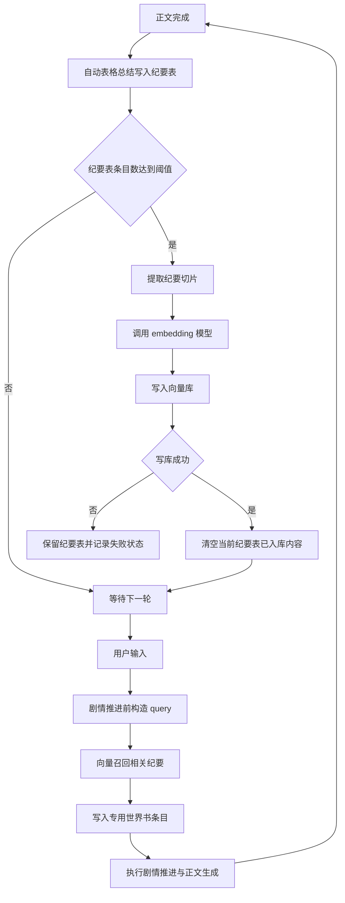

# 纪要表向量记忆召回接入世界书方案

## 1. 目标

在现有插件中新增一套向量记忆闭环，用于把纪要表中的纪要内容转为向量并存入向量库，在剧情推进前基于用户输入做相关性召回，将召回结果写入一个专用世界书条目，使后续剧情推进与正文生成都能消费相关记忆。

同时新增一条强约束：**当一批纪要条目成功完成向量化并写入向量库后，清空当前纪要表中已入库的内容，避免重复累计与重复召回。**

这不是普通的附加功能，而是一个完整的记忆流转链路：



---

## 2. 当前已确认事实

以下内容是基于现有项目实际文件确认到的，不是空想：

- 世界书相关 API 暴露入口已经存在，见 [`createWorldbookAiApi()`](src/presentation/bootstrap/api-groups/worldbook-ai-api.ts:28)。
- 世界书宿主侧 CRUD 已经有统一网关封装，见 [`getLorebookEntries_ACU()`](src/data/gateways/worldbook-gateway.ts:29)、[`setLorebookEntries_ACU()`](src/data/gateways/worldbook-gateway.ts:42)、[`createLorebookEntries_ACU()`](src/data/gateways/worldbook-gateway.ts:55)。
- 世界书相关 UI 页面已存在，但当前仅覆盖注入目标、来源与条目选择，见 [`generateWorldbookTabHTML()`](src/presentation/pages/main-popup-worldbook.ts:10)。向量模式配置区尚不存在。
- 历史计划中已经明确出现过纪要表结构语义，包括纪要、概览或概要、编码索引等字段，见 [`plans/summary_index_optimization_plan.md`](plans/summary_index_optimization_plan.md)。

这些事实足以支持方案设计，但还不足以直接无脑实现。

---

## 3. 当前仍未确认的关键前提

这些点如果不查清，后续实现会直接返工：

1. 纪要表的真实表名是否固定。
2. 纪要表字段名是否稳定，还是只能按列序识别。
3. 当前正文后自动总结写入纪要表的准确挂点在哪里。
4. 当前剧情推进前拦截用户输入并插入世界书更新的准确挂点在哪里。
5. 当前插件配置模型中应把向量配置挂到哪个设置分组。
6. 外部 embedding 服务与向量库的实际候选方案是什么。

这些都属于关键前提，不是“实现时再看”的小问题。

---

## 4. 最终目标流程

用户定义的目标流程，经过整理后应收敛为以下正式版本：

1. 正文生成完成后，插件自动执行表格总结，把最新纪要写入纪要表。
2. 当纪要表累计条目数达到阈值时，触发批量向量化。
3. 对这一批纪要条目生成 embedding 并写入向量库。
4. **只有在向量写库成功后，才清空当前纪要表中已入库的条目。**
5. 下一轮用户输入到来时，在剧情推进开始前，使用该用户输入作为查询文本执行向量召回。
6. 将召回出的相关纪要片段格式化后写入一个专用世界书条目。
7. 剧情推进与正文生成读取该世界书条目，获得相关记忆补充。
8. 正文结束后再次自动总结并写入纪要表，进入下一轮循环。

这是一套带有批处理入库、前置召回和清表策略的记忆闭环，而不是单次向量检索功能。

---

## 5. 核心设计原则

### 5.1 向量入库与剧情召回应解耦
不要把“向量化”和“召回”做成一个同步串行大函数。正确拆分是：

- 入库链路：负责纪要积累、批量 embedding、写库、清表
- 召回链路：负责用户输入 query、查询向量库、写入世界书条目

这样可以避免：
- 每次剧情推进都重复向量化
- 外部 embedding 慢请求拖垮剧情推进
- 纪要重复累计与重复召回

### 5.2 向量数据必须按聊天记录独立存储并跟随聊天层级生命周期
这是新增的硬约束，而且非常关键。助手你这个要求是对的，不然向量模块迟早把不同聊天、不同回退状态的记忆混在一起，污染程度会难看得像事故复盘材料。

具体要求应明确为：

- 向量数据必须**按每个聊天记录单独隔离**
- 向量模块应像表格数据一样，**从当前最新层的聊天记录实时读取有效数据范围**
- 聊天删除、回退、楼层截断后，向量可见数据也必须同步回退
- 最理想的实现不是把向量索引状态丢在独立全局存储里，而是让其**跟随聊天记录生命周期**

这意味着设计上不能只做一个外部向量库 namespace 然后长期堆数据不管。那种方案看起来省事，实际上和现有表格数据的版本语义是冲突的。

向量模块应遵守与聊天记录一致的事实边界：

1. 当前有效知识范围，以当前聊天最新可见楼层为准
2. 已被回退掉的纪要，不应继续参与召回
3. 已被删除的聊天层对应向量数据，不应继续残留在有效索引视图中

因此，本方案推荐采用**双层存储**：

- 外层：外部向量库，负责存放 embedding 与相似度检索所需数据
- 内层：聊天记录内的向量元数据，负责声明当前聊天哪些文档有效、哪些批次已提交、哪些楼层生成了哪些向量文档

也就是说，真正的“事实源”仍然应是聊天记录，而不是外部向量库本身。外部向量库只是检索加速层，不是权威状态源。

### 5.3 清空纪要表必须以写库成功为前提
这一点是这次新增约束的核心。

错误做法：
- 只要进入向量化流程就先清空纪要表
- embedding 成功但写库失败仍清空纪要表
- 部分条目写库成功、部分失败却全表清空

正确做法：
- 批次内仅对**确认已成功写入向量库**的条目进行清除
- 如果采用整批事务语义，则推荐“整批成功后整批清表”
- 如果采用部分成功语义，则必须保留失败项，不能误删

### 5.3 第一版只写一个专用世界书条目
不要把召回结果分散写入多个数据库生成条目。第一版应固定为一个专用条目，例如：

- `TavernDB-ACU-VectorMemory`

优点：
- 边界清晰
- 更新简单
- 排障容易
- 不污染现有总结条目、人物条目、大纲条目

### 5.4 召回前置于剧情推进
召回必须发生在剧情推进之前，而不是之后。否则剧情推进吃不到相关记忆，这就违背了目标。

---

## 6. 架构建议

### 6.1 分层原则
继续遵循项目现有分层：`presentation → service → data`。

不要把向量调用直接塞到 UI 层，也不要在 API 暴露层里堆业务实现。

### 6.2 建议新增模块

#### data 层
- [`src/data/gateways/vector-embedding-gateway.ts`](src/data/gateways/vector-embedding-gateway.ts)
- [`src/data/gateways/vector-store-gateway.ts`](src/data/gateways/vector-store-gateway.ts)

职责：
- embedding 网关：负责文本向量化
- vector store 网关：负责向量 upsert、query、delete

#### service 层
- [`src/service/vector/vector-index-build-service.ts`](src/service/vector/vector-index-build-service.ts)
- [`src/service/vector/vector-index-state-service.ts`](src/service/vector/vector-index-state-service.ts)
- [`src/service/vector/vector-recall-service.ts`](src/service/vector/vector-recall-service.ts)
- [`src/service/worldbook/vector-memory-entry-service.ts`](src/service/worldbook/vector-memory-entry-service.ts)
- [`src/service/plot/vector-recall-orchestrator.ts`](src/service/plot/vector-recall-orchestrator.ts)

职责：
- `vector-index-build-service`
  - 从纪要表提取可入库切片
  - 调用 embedding 和向量库 upsert
  - 返回成功和失败批次结果
- `vector-index-state-service`
  - 管理索引元数据
  - 记录成功入库批次与文档标识
- `vector-recall-service`
  - 基于 query 做 embedding 和召回
  - 做阈值过滤、去重、限长、格式化前整理
- `vector-memory-entry-service`
  - 把召回结果转成专用世界书条目内容
  - 创建或更新条目
- `vector-recall-orchestrator`
  - 在剧情推进前协调召回、格式化、世界书更新

#### presentation 层
- 在世界书配置页新增向量模式设置区，挂在 [`generateWorldbookTabHTML()`](src/presentation/pages/main-popup-worldbook.ts:10) 所属页面上。
- 在 API 暴露层通过 [`createWorldbookAiApi()`](src/presentation/bootstrap/api-groups/worldbook-ai-api.ts:28) 暴露手动调试入口，但不承载核心业务。

---

## 7. 数据模型设计

### 7.1 纪要切片文档结构
第一版建议：**纪要表一行 = 一个 document**。

建议文档结构：

```ts
interface VectorSummaryDocument {
  docId: string;
  rowKey: string;
  timeSpan: string;
  location: string;
  overview: string;
  indexCode: string;
  content: string;
  combinedText: string;
  contentHash: string;
  createdAt: string;
}
```

### 7.2 combinedText 组装方式
不要只向量化纪要正文。建议组装：

```text
时间跨度: ...
地点: ...
概览: ...
编码索引: ...
纪要内容: ...
```

原因：
- 用户输入常常命中地点、阶段、主题，而不一定命中正文原句
- 组合文本更适合检索语义

### 7.3 索引状态结构
如果清表策略生效，索引状态不能只依赖纪要表当前内容，否则清空后就失去追踪能力。

但这里必须再加一条边界：索引状态**不能只保存在全局插件配置里**。如果它不跟聊天记录绑定，那么聊天回退后状态就会失真，进而把已经失效的向量文档继续拿来召回。

因此建议拆成两层：

#### 聊天记录内元数据
这部分跟随聊天层级一起存活、删除、回退，是权威状态。

```ts
interface ChatVectorBatchMeta {
  batchId: string;
  sourceMessageId: string;
  docIds: string[];
  createdAt: string;
  summaryRowsSnapshot: string[];
}
```

可考虑像现有表格数据字段一样，挂在聊天消息扩展字段中，例如为每个触发入库的总结楼层写入一份批次元数据。具体字段名实现时再定，但原则必须是：**跟聊天记录走**。

#### 运行时索引视图
运行时从当前聊天最新可见楼层中扫描、合并、构建有效文档视图，再据此决定：

- 哪些向量文档当前有效
- 哪些文档在回退后应视为失效
- 哪些外部向量库文档需要被忽略或异步清理

```ts
interface VectorIndexState {
  namespace: string;
  lastBatchId: string;
  docs: Array<{
    docId: string;
    rowKey: string;
    contentHash: string;
    indexedAt: string;
    sourceMessageId: string;
    active: boolean;
  }>;
}
```

这里的 `active` 不是靠全局布尔缓存拍脑袋决定，而应由“当前聊天可见楼层”实时推导。

### 7.4 召回结果结构

```ts
interface VectorRecallMatch {
  docId: string;
  score: number;
  timeSpan: string;
  location: string;
  overview: string;
  indexCode: string;
  content: string;
}
```

---

## 8. 向量入库链路设计

### 8.1 触发条件
每次正文完成且纪要表总结写入后：

1. 读取纪要表当前条目数
2. 判断是否达到配置阈值
3. 达到阈值则触发批量向量化
4. 未达到阈值则等待下一轮

### 8.2 推荐批处理语义
第一版建议采用**整批成功才清表**的简单语义。

原因：
- 容易理解
- 容易实现
- 容易排障

流程：
1. 收集当前纪要表所有待入库条目
2. 批量 embedding
3. 批量 upsert 到向量库
4. 若整批成功，则清空本批纪要表条目
5. 若整批失败，则纪要表保持不变

### 8.3 为什么要清空纪要表
你新增这一条是合理的，但必须明确它的语义：

**纪要表在向量模式下不再是长期归档表，而是短期缓冲区。**

用途变成：
- 暂存最近尚未入向量库的纪要
- 达阈值后作为待处理队列
- 成功入库后清空，避免重复累计

这个设计带来的后果也必须接受：
- 如果后续还需要保留人类可读纪要历史，就必须另有长期存储载体
- 否则纪要历史将只存在向量库，不再存在本地纪要表

这是一个重要决策，不是无代价优化。

### 8.4 对清表策略的补充建议
如果你既要防重复累计，又不想完全丢失纪要历史，可考虑两个备选方案：

#### 方案 A：严格清表
- 向量写库成功后直接清空纪要表
- 优点：最简单，重复风险最低
- 缺点：本地不保留历史明文

#### 方案 B：归档后清表
- 向量写库成功后，把纪要表内容转移到归档表，再清空纪要表
- 优点：本地仍可追溯
- 缺点：实现更复杂，需要新增归档表逻辑

如果不额外提出归档需求，第一版建议按你现在要求执行**严格清表**。

---

## 9. 剧情推进前召回链路设计

### 9.1 触发时机
在剧情推进前拦截当前用户输入，执行以下流程：

1. 获取用户当前输入文本
2. 规范化 query
3. 调用 embedding 服务生成 query 向量
4. 调用向量库进行相似度召回
5. 对召回结果做过滤、去重、限长
6. 更新专用世界书条目
7. 继续剧情推进与正文生成

### 9.2 query 来源
本次方案已明确：**query 主来源是当前用户输入。**

仅在以下情况下建议做回退：
- 用户输入过短
- 用户输入无有效语义
- 用户输入只包含诸如“继续”“嗯”“好”这类空洞词

回退策略可选：
- 使用最近一轮上下文拼接用户输入
- 或放弃召回，仅保留上轮世界书记忆条目

### 9.3 召回控制参数
建议配置以下参数：
- `topK`
- `similarityThreshold`
- `maxEntryCount`
- `maxItemLength`
- `maxTotalLength`

不做这些限制，世界书条目长度会迅速膨胀。

---

## 10. 专用世界书条目设计

### 10.1 条目标识
建议固定 comment 或 name 前缀：

- `TavernDB-ACU-VectorMemory`

这样能通过现有世界书网关稳定定位和更新。

### 10.2 条目格式
建议写成结构化文本：

```markdown
## 相关记忆召回
### 记忆 1
- 相关度: 0.91
- 时间跨度: ...
- 地点: ...
- 概览: ...
- 编码索引: ...
- 内容: ...

### 记忆 2
- 相关度: 0.87
- 时间跨度: ...
- 地点: ...
- 概览: ...
- 编码索引: ...
- 内容: ...
```

### 10.3 更新规则
- 召回有结果：覆盖更新专用条目内容
- 召回无结果：写入“无高相关记忆”占位，或保留上次结果并标记时间
- 召回失败：不阻断主流程，建议保留旧条目内容并记录错误日志

---

## 11. 配置项设计

建议在现有设置模型中新增：

```ts
vectorMemory: {
  enabled: boolean;
  summaryTableName: string;
  thresholdCount: number;
  embeddingProvider: string;
  embeddingModel: string;
  embeddingApiUrl: string;
  embeddingApiKey: string;
  vectorStoreProvider: string;
  vectorStoreUrl: string;
  vectorStoreApiKey: string;
  namespaceStrategy: string;
  topK: number;
  similarityThreshold: number;
  maxEntryCount: number;
  maxItemLength: number;
  maxTotalLength: number;
  clearSummaryTableAfterIndex: boolean;
  keepPreviousMemoryOnEmptyRecall: boolean;
  fallbackToRecentContextWhenInputTooShort: boolean;
}
```

其中最关键的配置有：
- `thresholdCount`
- `clearSummaryTableAfterIndex`
- `topK`
- `similarityThreshold`

`clearSummaryTableAfterIndex` 在本方案里默认应为 `true`，因为这是当前明确要求。

---

## 12. 错误处理与风险控制

### 12.1 向量写库失败
处理策略：
- 纪要表不清空
- 索引状态不更新为成功
- 记录错误日志
- 允许下次重试

### 12.2 embedding 成功但 upsert 失败
处理策略：
- 视为整批失败
- 不清空纪要表
- 不标记成功

### 12.3 部分成功、部分失败
第一版建议不要做复杂局部提交，直接按整批失败处理。否则清表边界会变得很脏。

### 12.4 用户输入无效
处理策略：
- 输入过短时触发回退策略，或直接跳过召回
- 不应因为无效 query 报错阻断剧情推进

### 12.5 向量召回超时
处理策略：
- 设置超时
- 超时后放弃本轮召回
- 保留旧条目或写入空召回占位
- 主剧情推进继续执行

### 12.6 清表导致本地历史丢失
这是当前方案的结构性风险。

如果后续需要保留明文历史，必须再设计归档表或本地归档存储。当前方案中，这个风险是已知且接受的。

---

## 13. 详细实施步骤

### 阶段一：事实核实与配置准备
- [ ] 确认纪要表真实表名
- [ ] 确认纪要表列名与列序
- [ ] 确认正文总结写入纪要表的挂点
- [ ] 确认剧情推进前可拦截用户输入的挂点
- [ ] 确认向量配置挂载到现有设置模型的位置
- [ ] 确认 embedding 与向量库候选服务

### 阶段二：向量入库闭环
- [ ] 新增向量配置模型
- [ ] 新增 embedding 网关
- [ ] 新增 vector store 网关
- [ ] 新增纪要切片提取逻辑
- [ ] 新增批量索引构建服务
- [ ] 新增索引状态存储
- [ ] 在正文总结完成后检查条目阈值
- [ ] 达阈值时触发批量 embedding 与 upsert
- [ ] 整批成功后清空纪要表
- [ ] 失败时保留纪要表并记录日志

### 阶段三：剧情推进前召回闭环
- [ ] 获取当前用户输入并构造 query
- [ ] 调用向量召回服务
- [ ] 对召回结果做去重、过滤、限长
- [ ] 新增专用世界书条目格式化服务
- [ ] 将召回结果写入专用世界书条目
- [ ] 把该步骤插入剧情推进前主流程
- [ ] 确保召回失败不阻断剧情推进

### 阶段四：UI 与调试能力
- [ ] 在世界书页新增向量模式配置区
- [ ] 新增手动触发索引按钮
- [ ] 新增手动测试召回按钮
- [ ] 新增显示最近索引批次与最近召回状态的调试信息

### 阶段五：稳定性与回归验证
- [ ] 验证未达阈值时纪要表仅积累不清空
- [ ] 验证达阈值且写库成功后纪要表被清空
- [ ] 验证写库失败时纪要表不被误清空
- [ ] 验证剧情推进前成功写入专用世界书条目
- [ ] 验证召回为空时主流程仍正常运行
- [ ] 验证连续多轮循环无重复累计问题

---

## 14. 验收标准

满足以下条件才算方案落地成功：

1. 正文结束后纪要能正常写入纪要表。
2. 纪要表达到阈值后能自动触发向量化。
3. 向量写库成功后，纪要表中对应内容被清空。
4. 向量写库失败时，纪要表内容不会丢失。
5. 剧情推进前能使用用户输入完成向量召回。
6. 召回结果能稳定写入专用世界书条目。
7. 剧情推进和正文能读取该条目并消费相关记忆。
8. 整个流程能连续循环运行，不产生重复累计与明显脏数据。

---

## 15. 明确结论

本方案推荐正式按以下原则推进：

- 纪要表作为**待向量化缓冲区**使用
- 达到条目阈值后批量向量化写入外部向量库
- **确认写库成功后清空当前纪要表**，避免重复累计
- 剧情推进前以用户输入为 query 做相关性召回
- 将召回结果写入一个专用世界书条目
- 后续剧情推进与正文统一消费该条目
- 正文结束后再次自动总结，进入下一轮循环

这条路径是当前最清晰、边界最干净、最符合你需求的实现方向。

如果后续还要兼顾“本地长期可读纪要历史”，那就必须在本方案之外再补一层归档设计。否则，清表之后历史只存在向量库，不再存在纪要表。这一点必须提前接受，不能等实现完了再假装没看见。