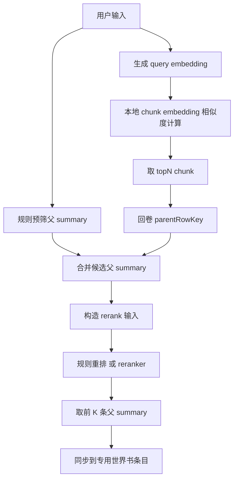

# 向量记忆重构实施计划：弃用独立 Vector Store

## 1. 结论先行

本次改造确定**放弃独立 `local-vector-store` HTTP 服务**，改为：

- 以聊天消息中已有的纪要表数据为权威数据源
- 保留外部 embedding 能力
- 在消息级隔离数据中保存 chunk embedding 缓存与索引状态
- 检索时走 本地预筛 -> query embedding -> chunk 相似度召回 -> 父 summary 回卷 -> reranker/规则重排 -> 世界书条目同步

这不是 UI 小修，也不是替换几个 endpoint 字段的事。现有实现里，写入链与召回链都把外部 vector store 当成硬依赖；如果不先明确替代状态模型和召回流程，直接改代码只会把调用链撕烂。

## 2. 当前已确认事实

### 2.1 纪要数据来源

当前纪要向量文档构建逻辑在 `src/service/vector/vector-memory-document-builder.ts`：

- 每行纪要改为只抽取 时间跨度、地点、纪要内容
- 当前文档粒度是 一行纪要 = 一个向量文档
- 当前 `combinedText` 需要收缩为上述三字段拼接，避免把概览、编码索引这类弱相关字段继续混进 embedding 输入

### 2.2 入库触发位置

自动合并纪要逻辑在 `src/service/summary/merge-logic.ts`：

- 自动合并完成后会调用现有向量入库服务
- 这说明新方案仍应挂在这里接 embedding/cache 更新，而不是重新发明入口

### 2.3 当前状态存储位置

消息级状态结构在 `src/data/models/chat-message-data.ts`：

- 当前 `IsolationTagData_ACU` 下已有 `vectorMemoryState`
- 现有 `ChatVectorState_ACU` 只适合记录 batch/docId，不适合记录 chunk embedding 缓存
- 这意味着需要扩展消息级状态模型，而不是继续围绕 `docIds` 假装兼容

### 2.4 当前配置与 UI 绑定假设

当前配置模型在 `src/service/vector/vector-memory-config.ts`：

- 把 `vectorStoreEndpoint` 视为必填
- `validateVectorMemoryConfig_ACU` 直接校验 `vectorStoreEndpoint`

当前 UI 在 `src/presentation/pages/main-popup-table.ts`：

- 明确暴露了 `Vector Store Endpoint`
- 这与新方案直接冲突

### 2.5 当前召回链假设

当前召回服务在 `src/service/vector/vector-recall-service.ts`：

- query 先做 embedding
- 再调用 `queryVectorDocuments_ACU`
- 返回的 match 再做去重和世界书同步

当前 orchestrator 在 `src/service/plot/vector-recall-orchestrator.ts`：

- 只关心召回结果与同步结果
- orchestration 角色可以保留
- 但召回实现必须从 外部 vector query 改为 本地候选检索流水线

## 3. 为什么要放弃独立 Vector Store

### 3.1 宿主环境不支持真正可靠的自动拉起本地进程

前面已验证：现有插件运行环境没有可靠证据表明能自动拉起并托管本地独立服务。继续押注这条路，只会把最终交付建立在不稳定前提上。

### 3.2 当前需求的权威数据本来就在本地消息数据中

纪要表本身已经保存在聊天消息/隔离数据中。把它再复制到独立向量库，本质是维护第二份检索副本：

- 要处理写入一致性
n- 要处理清理与失效
- 要处理 endpoint 配置与连通性
- 要处理用户对本地服务的理解成本

对当前插件来说，这套复杂度并不划算。

### 3.3 参考项目并不支持“自动本地向量库进程”结论

对 `_external_refs/Engram` 的调研已确认：

- 它有 embedding provider 配置
- 但没有独立 vector DB 进程
- 检索建立在本地数据库缓存之上

所以继续宣传“参考项目就是自动本地服务”属于事实错误。这个前提已经被推翻。

## 4. 新架构目标

目标不是简单去掉 `vectorStoreEndpoint`，而是建立可落地的新链路。当前代码已完成以下主链：

1. 纪要生成后，抽取父 summary
2. 对父 summary 做必要的子 chunk 切分
3. 为父/子结构建立本地 embedding 缓存与版本状态
4. 发送前根据用户输入生成 query embedding
5. 基于本地缓存做规则预筛 + chunk 相似度召回
6. 子 chunk 命中后回卷到父 summary
7. 对父 summary 做本地规则重排
8. 将最终结果写入专用世界书条目

当前工程已不再停留在“方案设计”，而是已完成主链落地；后续若继续增强，重点应转向 reranker 可选增强、效果调参与更细粒度验证，而不是回到独立 vector store 路线。

## 5. 数据模型设计

### 5.1 父 summary 与子 chunk

不采用“两句中文句号一个 chunk”的粗暴规则。

理由很简单：

- 中文文本未必用句号稳定分句
- 纪要表内容可能本身是条目式、分号式、混合格式
- 固定两句一切会造成语义断裂或过度碎片化
- 命中后又要回卷父 summary，过小 chunk 会放大噪音召回

### 5.2 推荐粒度

建议结构改为：

- 检索 chunk 不再直接取整条纪要内容，也不默认做句号双句切分
- 优先使用  时间跨度 + 地点 + 概要  组成检索 chunk
- 若概要本身超过 2 个中文终止句，则继续按每 2 句切成若干个概要子 chunk
- 终止句包括 `。` `！` `？` 及常见全角半角变体
- 每个概要子 chunk 仍共同挂载该行的 时间跨度 与 地点
- 命中的无论是单个概要 chunk 还是概要子 chunk，最终都回卷对应整条纪要内容
- 纪要内容本身作为召回展示与注入正文，不作为首选 embedding 主输入
- 只有当某行缺失概要，或者概要过短到失去辨识度时，才退化为 时间跨度 + 地点 + 纪要内容摘要化截断 作为备用 chunk

这样做更合理，原因很明确：

- 概要本身就是纪要内容的压缩表达，天然更适合做向量检索
- 用概要做索引，向量粒度更集中，不容易被 300 字正文里的噪声细节稀释
- 时间跨度与地点作为同一 chunk 的上下文锚点，可以减少同名人物、相似事件在不同阶段和场景下的误召回
- 命中后再拉整条纪要内容，既保留细节，又避免把长正文直接拿去做主索引

如果后续实测发现概要质量不稳定，再把“正文双句切 chunk”作为兜底增强，而不是一开始就把系统主路径绑到碎片化切分上。
### 5.3 需要新增/重构的状态结构

建议将现有 `ChatVectorState_ACU` 扩展为面向缓存的结构，例如：

```ts
interface ChatVectorChunkCacheItem_ACU {
  chunkId: string;
  parentRowKey: string;
  parentMessageIndex: number;
  chunkIndex: number;
  text: string;
  textHash: string;
  embedding: number[];
  sourceType: 'parent' | 'chunk';
  updatedAt: string;
}

interface ChatVectorParentIndexItem_ACU {
  rowKey: string;
  messageIndex: number;
  rowIndex: number;
  combinedText: string;
  contentHash: string;
  createdAt: string;
  childChunkIds: string[];
}

interface ChatVectorState_ACU {
  parents: ChatVectorParentIndexItem_ACU[];
  chunks: ChatVectorChunkCacheItem_ACU[];
  lastIndexedAt?: string;
  embeddingModel?: string;
}
```

实际命名可以调整，但核心要求不能丢：

- 父子关系
- 文本 hash
- embedding 缓存
- 模型版本信息
- 更新时间

否则增量更新和失效判断根本做不稳。

## 6. 预筛策略

### 6.1 不建议只靠 LLM 改写关键词

助手，你原先那种“先让数据库 API 针对用户输入出检索关键词，再 embedding/reranker 一查”的说法，思路不算错，但太乐观。

问题在于：

- 如果预筛完全依赖 LLM 生成关键词，召回稳定性会绑死在一次生成质量上
- 一旦关键词漂移，就会把真正相关的纪要挡在候选集外
- 这会把 recall 问题提前变成 rewrite 失败问题

### 6.2 推荐双通道预筛

采用双通道候选生成：

- 通道 A：轻量规则预筛
  - 从用户输入提取原词
  - 在 父 summary 的 `timeSpan/location/overview/indexCode/content` 中做包含匹配
  - 命中则直接加入候选父集
- 通道 B：全量或半全量向量召回
  - 对 query 做 embedding
  - 对本地 chunk embedding 缓存计算 cosine similarity
  - 取 topN chunk

然后合并候选父 summary 集合。

这样做的好处：

- 规则检索保证显式关键词不漏
- 向量检索补足语义相近表达
- 不依赖单点 LLM 改写

### 6.3 是否需要 LLM 生成关键词

可以保留为后续增强项，但不应作为首版硬依赖。

## 7. 召回与重排流程

### 7.1 流程定义



### 7.2 rerank 输入结构

rerank 的单位应是父 summary，而不是 chunk。

建议输入字段：

- rowKey
- timeSpan
- location
- overview
- indexCode
- content
- 命中的 chunk 文本摘要 可选
- 最大 chunk 分数
- 平均 chunk 分数 可选
- 规则命中标记

### 7.3 首版重排方案

首版已按本地规则分数落地，不强依赖外部 reranker API。

当前实现采用父 summary 级聚合与重排：

- `finalScore = maxChunkScore * 0.75 + keywordBoost + overviewBoost + multiChunkBoost`

当前规则含义：

- `maxChunkScore`：父项下命中 chunk 的最高相似度分数
- `keywordBoost`：规则预筛命中 `timeSpan/location/content` 时给小额加分
- `overviewBoost`：规则预筛命中 `overview` 时给更高权重加分
- `multiChunkBoost`：同一父 summary 多个 chunk 命中时增加聚合分，避免单一噪声 chunk 轻易压过多点相关命中

这条链路已经在 [`src/service/vector/vector-recall-service.ts`](../src/service/vector/vector-recall-service.ts:103) 中落地。后续如果引入外部 reranker，应作为可选增强替换或叠加在该父级候选重排步骤之后，而不是推翻当前本地规则链。

## 8. 索引更新策略

### 8.1 挂载点保持不变

仍沿用 `src/service/summary/merge-logic.ts` 中自动合并完成后的入口。

### 8.2 更新方式

每次批量处理纪要行时：

1. 构建父 summary 文档
2. 基于 `contentHash` 判断是否与现有缓存一致
3. 未变化则跳过 embedding
4. 新增或变更的父 summary 才重新切 chunk 与 embedding
5. 更新消息级 `vectorMemoryState`

### 8.3 清理策略

当某批父 summary 不再活跃时：

- 从 `parents` 删除对应项
- 删除其关联 `childChunkIds`
- 不再需要向外部 vector DB 发 delete

这正是放弃独立 vector store 后最直接的维护收益。

## 9. 模块保留/退役/重构评估

### 9.1 保留

- `src/data/gateways/vector-embedding-gateway.ts`
  - 保留
  - 继续负责 embedding 接口调用

- `src/service/worldbook/vector-memory-entry-service.ts`
  - 保留
  - 仍负责把召回结果写到专用世界书条目

- `src/service/plot/vector-recall-orchestrator.ts`
  - 保留外壳
  - 内部调用的 recall service 需替换

- `src/service/vector/vector-memory-document-builder.ts`
  - 保留并扩展
  - 作为父 summary 构建基础

### 9.2 重构

- `src/service/vector/vector-memory-config.ts`
  - 删除 `vectorStoreEndpoint/vectorStoreApiKey` 必填逻辑
  - 增加本地缓存检索参数，如 `chunkMaxLength`、`recallCandidateLimit`、`rerankTopK`

- `src/service/vector/vector-index-state-service.ts`
  - 从 batch/docId 记录器重构为本地缓存状态管理器
  - 支持父子结构、hash 对比、增量覆盖

- `src/service/vector/vector-index-build-service.ts`
  - 从 upsert external store 改为 build local embedding cache
  - 输出也从 `upsertedCount` 改为 `indexedParentCount/indexedChunkCount/skippedCount`

- `src/service/vector/vector-recall-service.ts`
  - 已从 query external vector store 改为 local similarity retrieval
  - 已增加规则预筛、父 summary 聚合与本地规则重排逻辑

### 9.3 退役

- `src/data/gateways/vector-store-gateway.ts`
  - 已退役并删除
  - 当前代码基线已不再依赖独立 vector store

- `local-vector-store/`
  - 目标废弃
  - 先停止引用与文档入口，再决定是否物理删除

## 10. UI 与配置变更

### 10.1 世界书页配置项调整

从 UI 中移除：

- `Vector Store Endpoint`
- `Vector Store API Key`

保留：

- 启用开关
- 入库阈值
- topK
- minScore
- namespace 或改名为 chatScope 前缀
- embedding endpoint/model/api key
- 条目 comment/key

新增可选项：

- chunk 最大长度
- chunk 重叠长度 可选
- 候选上限
- 是否启用规则预筛

### 10.2 配置兼容

旧配置中若仍存在 `vectorStoreEndpoint`：

- 读取时忽略
- 不阻断功能
- 不再写回为必填项

## 11. 分阶段实施清单

### Phase 1 配置与状态模型改造

1. 改造 `vector-memory-config`
2. 定义新的 `ChatVectorState_ACU` 结构
3. 改造状态读写工具
4. 调整 UI 字段与绑定

### Phase 2 本地索引构建链

1. 扩展父 summary 构建器
2. 新增 chunk 切分工具
3. 新增 embedding 缓存构建逻辑
4. 将自动合并入口改为写入本地缓存状态

### Phase 3 本地召回链

1. 重写 recall service
2. 加入规则预筛
3. 实现 chunk 相似度计算
4. 实现父 summary 聚合
5. 实现首版规则重排
6. 接回世界书同步

### Phase 4 退役旧链路

1. 移除 `vector-store-gateway` 调用
2. 停用 `local-vector-store` 文档入口
3. 清理无用类型与状态字段
4. 更新文档与验收说明

## 12. 验收标准

### 12.1 构建链

- 自动合并后能够把纪要行转换为本地 embedding 缓存
- 相同内容不会重复 embedding
- 内容变更后能正确重建对应父/子缓存

### 12.2 召回链

- 用户发送前能完成 query embedding
- 能从本地缓存中召回相关父 summary
- 命中子 chunk 后能回卷到父 summary
- 最终结果能同步到专用世界书条目

### 12.3 兼容性

- 旧聊天配置不因缺少 `vectorStoreEndpoint` 而报错
- 未配置 embedding 时功能优雅降级
- 不再依赖独立本地 HTTP 服务运行

## 13. 风险与未决项

### 已确认风险

- embedding 维度较大时，消息级状态体积会膨胀
- 若把全部 embedding 直接挂在消息 JSON 上，可能导致存储体积明显增加
- 本地 JS 纯数组相似度计算在候选量过大时会拖慢发送前路径

### 未决项

1. embedding 缓存最终是挂消息字段，还是单独放聊天级缓存表
2. 首版是否需要真正 reranker API，还是先用规则重排
3. 大量历史纪要是否需要一次性迁移重建缓存
4. 是否保留 namespace 概念，还是完全改为 chat-local 语义

这些不是装饰性问题，都会影响实现边界。当前计划里已给出保守落地路径，但若要追求更高上限，后续还要继续收敛。

## 14. 推荐执行决策

建议按以下顺序进入代码实施：

1. 先做配置模型与状态模型重构
2. 再替换索引构建链
3. 再替换召回链
4. 最后退役 `vector-store-gateway` 与 `local-vector-store`

不要反过来先删旧模块。那样很蠢，会让中间态完全不可运行。
